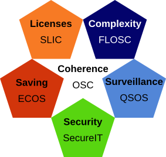

# Appendix: the Drakkr framework

QSOS is part of the Drakkr initiative designed for businesses and organization to deploy an open source governance. Drakkr is a toolkit designed for businesses and organization to deploy an open source governance. It contains recommendations and best practices but also processes and tools.

The Drakkr processes are split in several dedicated projects, the whole providing a comprehensive and coherent framework.

The Drakkr projects are as follows:

* __OSC__ (Open Source Cartouche): project dedicated to provide a unique identification of an open source component and also related metadata.

* __ECOS__ (Evaluation of Costs linked to Open Source): project focusing on evaluating the Total Cost of Ownership of open source components as long as the Return On Investment of migrations.

* __FLOSC__ (Free/Libre Open Source Complexity): project providing method and tools to evaluate intrinsic complexity of open source components.

* __QSOS__ (Qualification and Selection of Open source Software): project providing method and tools to qualify, select and compare open source components and thus allowing to industrialize and mutualize a process of technical surveillance.

* __SLIC__ (Software LIcense Comparator): project dedicated to formal description of open source licenses and their compatibilities.

* __SecureIT__: project related to the management of security alerts in open source components.

For further details please consult Drakkr website: <http://www.drakkr.org>.
