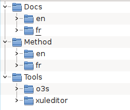

% QSOS Maintainer Guide
% 
% Version 2.0 - 18/02/2013

# License

Copyright © 2013 Atos.

Permission is granted to copy, distribute and/or modify this document under the terms the GNU Free Documentation License v1.2 published by the Free Software Foundation with no Invariant section, no Front-Cover Texts, and no Back-Cover Texts.

A copy of the license is available at <http://www.gnu.org/copyleft/fdl.html>.

# Changelog

---------------------------------------------------------------------------
 Version   Date       Auteurs           Commentaires
--------- ----------  ----------------- -----------------------------------
  2.0      18/02/13   Raphaël Semeteys  Initial version.
--------------------------------------- -----------------------------------

# Introduction

This document aims to give directions and guidance regrading maintenance of the QSOS project itself. We do not consider here maintenance of data components like QSOS templates or evaluation which are managed in the dedicated Git repositories _QSOS-Master.git_ and _QSOS-Incomming.git_. 

Components discussed here are called core components and are managed in the _QSOS.git_: 

* Documentation related to the QSOS project itself: method, tutorial, roadmap...

* QSOS formats and related XML documents like XSD schemas, XSL transformations...

* Tools developped to help use the QSOS method, manipulate its formats and manage data components.

# Version naming convention

Versions of QSOS core components (documents, formats and tools) follow the X.Y pattern:

* X is a number representing a major version.

* Y is a number representing a minor subversion of the major version.

Majors versions are generally set by the QSOS format itself (`.qsos` file format) since major changes on this format imply modification of almost every other component of the project.

So the rule is that when the QSOS format changes its major version, every other component should also change to this new major version.

Impacts of a minor version is generally restricted to a specific component. Therefore QSOS components don't necesseraly share minor versions.

# The QSOS.git repository

As explained before, QSOS.git should not be mistaking with repositories for QSOS data components. Its purpose is to store and manage maintenance of QSOS core components.

The QSOS.git repository is structured like this:

* Docs: folder for QSOS documentation, split by language.

* Method: folder containing the QSOS method itself, split by language.

* Tools: folder for QSOS tools and format.

TODO: Give links to actual repository (on GitHub ?)

# Modification of QSOS core components

## Modification of QSOS method and documents

In QSOS, documents are considered like source code. They are coded in Markdown^[<http://daringfireball.net/projects/markdown/> with Pandoc extensions] syntax, exported by Pandoc^[<http://johnmacfarlane.net/pandoc/>] in several formats and built by Make^[<http://www.gnu.org/software/make/>]. 

The source documents are called _edocs_ (because _edoc_ is juste like _code_, when you read from right to left).

Let's use the QSOS method itself to illustrate how to manipulate edocs.

TODO:

* Explain the documentation process based on Markdown/Pandoc source and exports to PDF and Gitit
* Explain the generic Makefile

## Modification of QSOS tools

### Modification of O3S

TODO:

* Detail O3S structure (frontends, backend, Git repositories) and design
* Detail technical aspects of O3S

### Modification of XulEditor

TODO:

* XulEditor link with O3S
* Detail XulEditor design
* Briefly introduce Mozilla's technical platform and redirect to appropriate links
* Detail how to build and publish a new version of XulEditor (Makefile, packaging, publication on the Web)

# Impact analysis of some modifications

## Modification of the QSOS method

TODO:

* Impacts of the Maturity axis of criteria (XML documents of reference: `criteria-maturity_*.xml`, XulEditor's external and internal XSLT, template bootstraping, method itself)

## Modification of the QSOS format

TODO:

* Impacts of a QSOS format modification (XSD, XSLT, libs, tools)

# Translation and localization

QSOS has been designed as a international project. Therefore everything is in place to ease its translation in a new language.

This section will guide you through the different components to be translated and the related techniques. Since a good example is often better than a lot of theory, let's consider translateing QSOS in English.

## Prerequisites

You need to determine what ISO 639-1^[<http://en.wikipedia.org/wiki/List_of_ISO_639-1_codes>] language code to use. In our example it is _en_.

For some translation techniques you'll also need the ISO 3166-1 country code^[<http://en.wikipedia.org/wiki/ISO_3166-1>]. In our exemple let's use _US_, which gives us a full localization name of _en-US_.

These codes will be used to identify the English translation files.

## Translation of the QSOS method

The source files of the QSOS method are stored in the QSOS.git repository, in the _Method_ folder. 

Here is how to proceed to create a new translation: 

* Create a new subfolder with the language code name (here _en_) and copy the content of an existing translation.

* Rename all files to integrate the language code name (i.e. _Method/fr/qsos-head_fr.md_ becomes _Method/en/qsos-head_en.md_ and so on).

* Translate the `.svg` files in _Images_ and export them in `.png` files (by using Inkscape^[<http://www.inkscape.org>] for instance).

* Translate the XML file describing the QSOS Maturity section (here _criteria-maturity_en.xml_)

* Translate contents  of the `.md` files, do not forget to reference your translated images. You can apply the _/Tools/o3s/formats/xml/xslt/evaluation-template-markdown.xsl_ transformation to the pevious XML file to generate part of the _qsos-appendixA_en.md_ file.

* Tanslate the LaTeX template (here _qsos-template_en.latex_): you probably only need to translate line 42.

* Adapt the _Makefile_  file to reference your translated files, you probably only need to modify the _LANG_ and _TITLE_ parameters.

You should now be able to export your translated version of the method in PDF and Gitit formats with `make`.

## Translation of other QSOS documents

Proceed as explained above for the Method to translate other QSOS documents, for instance:

* QSOS Tutorial: in _Docs/_en_/Tutorial_ folder.

* This Maintainer Guide: in _Docs/_en_/Maintainer_ folder.

## Translation of QSOS website

QSOS Website is based on the Drakkr^[Visit <http://www.drakkr.org> for further details] project Web infrastructure:

* Dynamic pages: based on the open source Content Management System _WordPress_^[<http://wordpress.org>].

* Static pages: based on the open source Wiki _Gitit_^[<http://gitit.net>].

### Dynamic pages (WordPress)

TODO: complete when new WordPress infrastructure is defined and deployed.

### Static pages (Gitit)

Drakkr's Gitit is deployed with git as a backend for the pages.

TODO: complete with repo structure and description on how to export edocs as pages.

## Translation of QSOS reference template

### Template bootstraps

The bootstraps to create new QSOS templates are stored in the QSOS.git repository, in the _Tools/o3s/formats/xml/template_ folder. Duplicated an existinf `.mm` file and rename it appopriatly (here _template_en.mm_).

Use FreeMind^[<http://freemind.sourceforge.net>] to open and translate your file:

* Reuse the QSOS Maturity section (here _criteria-maturity_en.xml_) to translate the _Maturity_ node. 

* Translate the other nodes, __except__ the _Metadata_ subnodes: _version_, _language_, _authors_, _author_, _name_, _email_, _dates_, _creation_, _update_.

* Do not forget to put your language code name (here _en_) in the node under the _language_ node.

### Template to evaluation XSLT

In the QSOS.git repository, in the _Tools/o3s/formats/xml/xslt_ folder, the Template to Evaluation XSLT must be translated (here _template-to-evaluation_en.xsl_): copy the _Maturity_ `<section/>` from _criteria-maturity_en.xml_.

## Translation of QSOS tools

### Translation of O3S

Here are the files you have to translate in O3S:

* For the O3S frontend (_Tools/o3s/app/_ folder):

    - _locales/en.php_: translate the `$msg` array.

    - _config.php_: set the `$default_lang` to your locale and add it to the `$supported_lang` array (for instance `array('fr', 'en')`).

* For the 03S backend (_Tools/o3s/backend/app_ folder):

    - _lang/en.php_: translate the `TXT_*` constants.

    - _conf.php_: add a`elseif (strstr($lang[0], 'en'))` instruction block to point to the translation file (here `lang/en.php`).

### Translation of XulEditor

* For the XulEditor GUI (_Tools/xuleditor/chrome/locale_ folder):

    - Create a new folder for your translation, using its full localization name (here _en-US_).

    - Copy thete contents of an existing translation.

    - In all `*.dtd` files: translate attribute values of `<!ENTITY/>` elements. 

    - Translate all `*.properties` files.

* For the XSL transformations included in XulEditor (_Tools/xuleditor/chrome/content_ folder):

    - In the _compatibility.js_ file: add a _template_to_qsos_2_0_en_ variable containing the result of this command `sed 's/"/\\"/g' <file.xsl> | sed 's/$/\\/g'` where `<file.xsl>` points to the previously translated Template to Evaluation XSLT (here _Tools/o3s/formats/xml/xslt/template-to-evaluation_en.xsl_).

* Update XulEditor packaging and build (_Tools/xuleditor_ folder):

    - In _chrome.manifest_: add a `locale` instruction (here `locale qsos-xuled en-US chrome/locale/en-US/`)

    - In _Makefile_: add paths to your GUI translated files in the _LOCALE_ parameter.

# Appendix: the Drakkr framework

QSOS is part of the Drakkr initiative designed for businesses and organization to deploy an open source governance. Drakkr is a toolkit designed for businesses and organization to deploy an open source governance. It contains recomandations and best practices but also processes and tools.

The Drakkr processes are split in several dedicated projects, the whole providing a comprehensive and coherent framework.

The Drakkr projects are as follows:

* __OSC__ (Open Source Cartouche): project dedicated to provide a unique identification of an open source component and also related metadata.

* __ECOS__ (Evaluation of Costs linked to Open Source): project focusing on evaluating the Total Cost of Ownership of open source components as long as the Return On Investment of migrations.

* __FLOSC__ (Free/Libre Open Source Complexity): project providing method and tools to evaluate intrisic complexity of open source components.

* __QSOS__ (Qualification and Selection of Opensource Software): project providing method and tools to qualify, select and compare open source components and tus allowing to industrialize and mutualize a process of technical surveillance.

* __SLIC__ (Software LIcense Comparator): project dedicated to formal description of open source licenses and their compatibilities.

* __SecureIT__: project related to the management of security alerts in open source components.

For further details please consult Drakkr website: <http://www.drakkr.org>.
