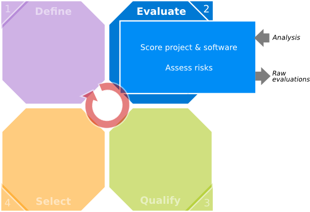

# Step 2 : Evaluate

## Purpose

The purpose of this step is to evaluate free and open source software. Information on the open source community are retrieved in order to score the software based on the criteria from the previous step. This analysis grid or template is then a tree of criteria.

This method can be used as part of a more general approach of technology watch that is not entirely discussed here.

## Evaluation of a version of a piece of software

Every version of a piece of software is described in an identity card. This card contains, in addition to the name of the software and its version, information, a description and a detailed analysis of provided features.

### Evaluation templates

The QSOS evaluations are done from the templates that describe the different criteria and their structure.
The evaluation criteria of the maturity of the project are imposed by the method and described further. They are completed by criteria describing expected features of the type of the evaluated software.

### Scoring

Criteria are assigned a discrete score from 0 to 2.

The evaluation templates contain the meaning of the three scores 0, 1 and 2 for every criterion. Regarding the functional coverage, the scoring rule is usually the following :

 Score     Description
-------   ------------------
  0       Functionality not covered.
  1       Functionality partially covered.
  2       Functionality fully covered.

These scores will be used in the selection step to compare and filter the software depending on the weighting specified during the qualification step.

It is possible to apply the general approach in an iterative way. At the evaluation level, it means to have the possibility to score the criteria several times. It then doesn't block the general process when only parts of the notes are available. When all criteria are evaluated, the score of the first two levels are then recalculated.
