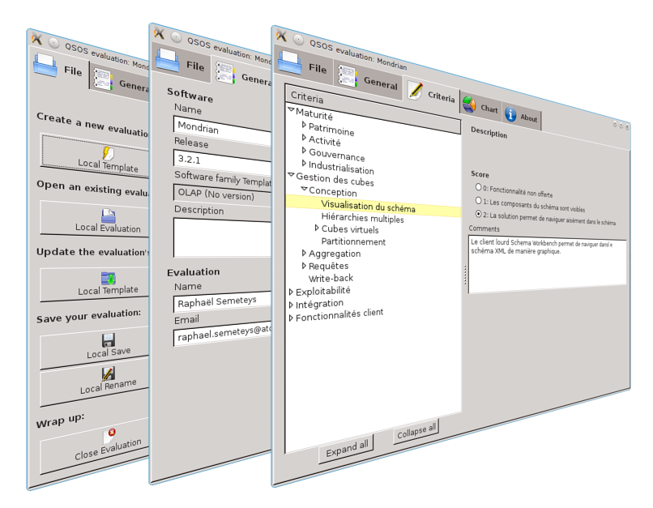

# Le projet QSOS

## Un projet libre et communautaire

Outre le fait de proposer un méthode, QSOS constitue un projet libre et communautaire voué à la veille technologique collaborative sur les logiciels open source.

Ainsi, les principaux objectifs du projet sont les suivants :

* gérer les évolutions de la méthode et du format de stockage des fiches d'évaluations ;

* centraliser les référentiels et notamment le stockage des templates, des fiches d'identité et des fiches d'évaluations ;

* fournir des outils pour faciliter l'application de la méthode QSOS ;

* assister les utilisateurs dans l'utilisation de la méthode via des bonnes pratiques et des espaces de communication.

## Outils et formats utilisés

Le projet libre QSOS propose également des outils pour dérouler le processus de la méthode et faciliter la collaboration autour des évaluations réalisées, ainsi que des formats de document pour stocker et manipuler les templates et les évaluations.

Le schéma ci-dessous présente et positionne les différents outils et formats existants.

### Templates

__Outil FreeMind__

Les templates sont des grilles de couverture fonctionnelle propres à chaque domaine logiciel. Avant de pouvoir réaliser une évaluation d’un logiciel donné, il faut donc disposer du template adapté.

Le projet QSOS utilise des cartes heuristiques (ou *mindmap*) pour concevoir et documenter ses templates. Le choix a été fixé sur la solution libre FreeMind^[<http://freemind.sourceforge.net>] du fait de sa portabilité et de son format XML permettant la transformation des templates au format `.qsos`, décrit plus bas, via une transformation XSL.

__Format `.mm`__

Les templates d'évaluations sont décrits et stockés au format défini et utilisé par FreeMind (extension `.mm`).

Ce format est décrit sur le site officiel du projet. Il s'agit d'un format XML qui est utilisé par QSOS comme format pivot en ce qui concerne les templates. Les fiches d'évaluations vierges utilisées pour réaliser des analyses QSOS de logiciels sont générées à partir de ce format via des transformation XSL.

Les cartes heuristiques représentant des templates QSOS doivent respecter un formalisme particulier pour pouvoir être transformées en fiches d'évaluation :

1. les descriptions des critères doivent être entourées (menu « Mise en forme/Bulle » de FreeMind) ;

2. les descriptions des notes 0, 1 et 2.

Le fichier XSL permettant de transformer les templates en fiches d'évaluations est disponible sur le site Web du projet QSOS. FreeMind permet d'appliquer la transformation via le menu « Fichier/Exporter/En utilisant une XSLT... ».

### Évaluations

__Outil XulEditor__

XulEditor est un outil de saisie et de gestion d'évaluations QSOS. Il permet de réaliser les opérations suivantes :

* créer une nouvelle évaluation à partir d'un template au format `.mm` (template local ou provenant du référentiel QSOS) ;

* ouvrir et modifier un évaluation existante (évaluation locale ou provenant du référentiel QSOS) ;

* appliquer une nouvelle version de template à une évaluation (sans perdre les données d'évaluations existantes) ;

* sauvegarder une évaluation (en local ou dans le référentiel QSOS).

XulEditor ne permet donc pas de modifier un template `.mm` et ne manipule que des évaluations au format `.qsos`.

Il s'agit d'une application utilisant la plateforme technologique du projet Mozilla. Elle peut être déployée en tant qu'extension au navigateur Firefox ou en tant qu'application XulRunner. 

Reportez-vous au site Web du projet QSOS pour plus de détails sur l'installation de XulEditor.

__Outil O3S (Open Source Selection Software)__

O3S est application Web permettant de visualiser, pondérer et comparer les évaluations QSOS selon le processus décrit dans la méthode. Elle permet de visualiser, comparer, exporter les évaluations QSOS au format OpenDocument, ainsi que générer des graphes au format SVG. 

Elle est accessible en ligne à l'adresse suivante : <http://www.qsos.org/o3s/>.

Il est également possible d'installer une instance d'O3S locale à votre organisation. Reportez-vous au site Web du projet QSOS pour plus de détails sur ce sujet.

__Format `.qsos`__

Les évaluations sont décrites et stockées dans un format pivot XML spécifique à QSOS. Le schéma XML est disponible sur le site Web du projet QSOS. Ce chapitre en décrit les principes de structuration.  
L'extension des fichiers est `.qsos`.

La balise principale est `<document/>`, elle est constituée ainsi :

* un entête `<header/>` contenant les métadonnées liées de la fiche d'évaluation (auteurs de l'évaluation, langue, template utilisé, versions de QSOS et du template, dates de création et de validation...) ;

* un ou plusieurs axes (`<section/>`) de critères d'évaluation :

    + eux-mêmes composés de critères d'évaluation (`<element/>`) pouvant être imbriqués les uns dans les autres, et des descriptions (`<desc/>`) ;
    
    + dans cet arbre de balises, les critères situés au plus profond de la hiérarchie contiennent les significations liées aux notes 0, 1 et 2 (`<desc0/>`, `<desc1/>` et `<desc2/>`), la note d'évaluation (`<score/>`) ainsi qu'une zone de commentaire pour justifier plus précisément la note (`<comment/>`).
    
Ci-suit une illustration de cette structuration :

~~~ {.xml}
<?xml version="1.0" encoding="UTF-8"?>
<document>
   <header>
      <authors>
         <author>
            <name>Nom d'un auteur de l'évaluation</name>
            <email>Email de l'auteur</email>
         </author>
         <!-- Autres <author/> éventuels -->	 
      </authors>
      <dates>
         <creation>Date de création</creation>
         <validation>Date de validation</validation>
      </dates>
      <appname>Nom du logiciel</appname>
      <desc>Description rapide du logiciel</desc>
      <release>Version du logiciel</release>
      <licenseid>Identifiant de la licence principale</licenseid>
      <licensedesc>Nom de la licence principale</licensedesc>
      <url>URL du site Web du logiciel</url>
      <demourl>URL du site Web de démonstration</demourl>
      <language>Langue d'évaluation : en, fr...</language>
      <qsosappname>Identifiant CPE de la version</qsosappname>
      <qsosformat>Format de QSOS utilisé, ici : 2.0</qsosformat>
      <qsosspecificformat>Version du template</qsosspecificformat>
      <qsosappfamily>Nom du template d'évaluation</qsosappfamily>
   </header>
   <section name="maturity" title="Maturité">
      <!-- <section/> imposée et versionnée par QSOS -->     
   </section>     
   <section name="Identifiant-unique-1" title="Nom de la section">
      <element name="Identifiant-unique-2" title="Nom du critère">
         <desc>Description du critère</desc>
         <element name="Identifiant-unique-3" title="Nom du sous-critère">
         <desc>Description du sous-critère</desc>
            <desc0>Signification de la note 0</desc0>
            <desc1>Signification de la note 1</desc1>
            <desc2>Signification de la note 2</desc2>
            <score>Notation du critère : 0, 1 ou 2</score>
            <comment>Commentaire motivant la note</comment>
         </element>
         <!-- Autres <element/> éventuels -->
      </element>
      <!-- Autres <element/> éventuels -->
   </section>
   <!-- Autres <section/> éventuelles -->
</document>
~~~

Il s'agit donc d'un arbre XML composé d'un entête (`<header/>`) et de sections (`<section/>`) contenant des éléments (`<element/>`). Les feuilles de cet arbre sont des critères d'évaluation pouvant être notés _0_, _1_ ou _2_.

Ce format est utilisé comme pivot par les outils proposé par le projet QSOS pour réaliser des exports dans d'autres formats XML, tels que HTML, SVG ou encore OpenDocument.

La structure détaillée de ce format est décrite au sein d'un schéma XSD, disponible sur le site Web du projet QSOS.

__Moteur et référentiel QSOS__

Le moteur QSOS consiste en une série d’outils pour valider, contrôler et publier les évaluations et les templates QSOS stockées dans le référentiel.

Le référentiel est décomposé en deux dépôts Git dédiés aux stockage de deux d'évaluations et de templates :

* le dépôt *Incoming* : réservé à la publication, au partage et à la manipulation d'évaluations et de templates par la communauté, il est accessible par tous via O3S et requiert uniquement la création d'un compte utilisateur dans l'application ;

* le dépôt *Master* : dédié au stockage des évaluations et aux templates considérés comme de qualité et ayant été validés par un modérateur de la communauté QSOS.

Outre ces deux dépôts réservés aux documents produits et utilisés par la méthode QSOS, le projet utilise également un dépôt Git pour le développement de ses outils et un autre pour sa documentation.

La documentation est écrite au format Markdown^[<http://daringfireball.net/projects/markdown/>], utilisé comme format pivot par Pandoc^[<http://johnmacfarlane.net/pandoc/>] pour export aux formats PDF et HTML, et par Gitit^[<http://gitit.net>] pour le wiki du projet.

En synthèse, voici un récapitulatif des différents dépôts Git du projet :

------------------------------------------------------------------------------
Dépôt                     Fonction
------------------------  ----------------------------------------------------
QSOS.git                  Outils et formats du projet

QSOS-Incoming.git         Templates et évaluations en mode bac à sable

QSOS-Master.git           Templates et évaluations validés par la communauté

Drakkr.git                Documentation de QSOS et des autres projets Drakkr^[Consultez l'annexe B pour plus de détails sur le framework Drakkr]
------------------------------------------------------------------------------

Reportez-vous au site Web du projet QSOS pour cloner ces différents dépôts.

## Comment contribuer ?

L'objectif du projet QSOS est de mutualiser l'effort de veille sur les logiciels open source. Il se veut donc résolument communautaire : plus grand est le nombres de contributeurs plus grands sont le nombre, la qualité et l'objectivité des évaluations.

Vous pouvez contribuer au projet de plusieurs manières :

* en créant ou en mettant à jour des templates et des évaluations ;

* en traduisant les templates, les évaluation ou la documentation ;

* en participant au développement des outils du projet ;

* en faisant la promotion de la méthode et du projet.

Reportez-vous au site Web du projet QSOS pour plus de détails sur la gouvernance de la communauté QSOS.
