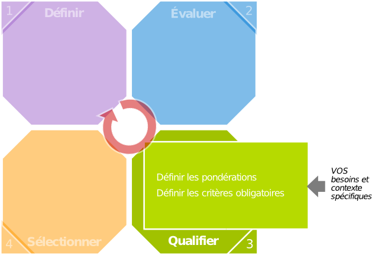

# Étape 3 : Qualifier

## Objectif

L'objectif de cette étape est de définir un ensemble d'éléments traduisant les besoins et les contraintes liés à la démarche de sélection d'un logiciel Open Source. Il s'agit ici de qualifier le contexte dans lequel il est envisagé d'utiliser le logiciel libre, de manière à obtenir un filtre utilisé par la suite dans l'étape « Sélectionner » du processus général.

## Filtres

### Filtre sur l'identité

Un premier niveau de filtrage peut être posé au niveau des données relatives à l'identité des logiciels. Il peut s'agir, par exemple, de ne considérer que les logiciels d'un type donné du référentiel, ou n'étant distribué que selon les termes d'un licence donnée.

### Filtre sur la maturité du projet
Le degré de pertinence de chaque critère de maturité est positionné en fonction du contexte :

* critère non pertinent, à ne pas intégrer au filtre ;

* critère pertinent ;

* critère critique.

Cette pertinence sera traduite par une valeur numérique de pondération à l'étape suivante du processus en fonction du mode de sélection utilisé.

### Filtre sur la couverture fonctionnelle

Chaque fonctionnalité décrite dans le template d'évaluation est affectée d'un niveau d'exigence, choisi parmi les suivants :

* fonctionnalité requise ;

* fonctionnalité optionnelle ;

* fonctionnalité non requise.

Ces exigences seront associées à des valeurs de pondération lors de l'étape « Sélectionner », en fonction du mode de sélection retenu.
