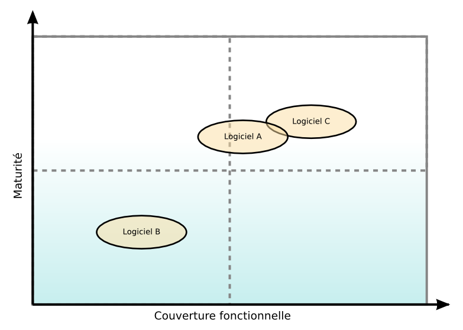
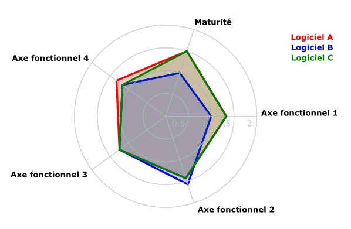

# Étape 4 : Sélectionner

## Objectif

L'objectif de cette étape est de sélectionner le ou les logiciels correspondant aux besoins de l'utilisateur, ou plus généralement de comparer des logiciels du même type.

## Modes de sélection

Deux modes de sélection sont possibles :

* la sélection stricte ;

* la sélection souple.

### Sélection stricte

La sélection stricte se base sur un processus d'élimination directe dès qu'un logiciel ne répond pas aux exigences formulées dans l'étape :

* élimination des logiciels ne correspondant pas au filtre sur la fiche d'identité ;

* élimination des logiciels n'offrant pas les fonctionnalité requises par le filtre sur la couverture fonctionnelle ;

* élimination des logiciels dont les critères de maturité ne satisfont pas aux pertinences définies par ou avec l'utilisateur :

    + la note d'un critère pertinent doit être au moins égale à 1 ;
 
    + la note d'un critère critique doit être au moins égale à 2.

Cette méthode est très sélective et peut, en fonction du niveau d'exigence de l'utilisateur, ne retourner aucun logiciel éligible.

Les logiciels ayant passé la sélection sont ensuite affectés d'une note globale déterminée par pondération, de la même manière que dans la sélection souple.

### Sélection souple

Cette méthode est moins stricte que la précédente car plutôt que d'éliminer les logiciels non éligibles au niveau de la couverture fonctionnelle ou de la maturité, elle se contente de les classer tout en mesurant l'écart constaté par rapport aux filtres définis précédemment.

Elle se base sur des valeurs de pondération dont les règles d'attribution sont détaillées dans les paragraphes suivants.

__Pondération fonctionnelle__

La valeur de pondération se base sur le niveau d'exigence de chaque fonctionnalité de l'axe de la couverture fonctionnelle.

Niveau d'exigence              Pondération
---------------------------- ---------------
Fonctionnalité requise           3
Fonctionnalité optionnelle       1
Fonctionnalité non requise       0

__Pondération sur la maturité__

La valeur de pondération se base sur le degré de pertinence de chaque critère de maturité.

Niveau d'exigence              Pondération
---------------------------- ---------------
Critère critique                3
Critère pertinent               1
Critère non pertinent           0

### Comparaison

Les logiciels d'un même domaine peuvent également être comparés entre eux selon les notes pondérées obtenues lors des étapes précédentes.

Les figures suivantes illustrent ce qu'il est alors possible d'obtenir en synthèse. L'application O3S, présentée plus loin, permet d'exporter les comparaisons dans différent formats (OpenDocument, HTML et SVG).

