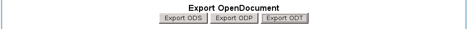
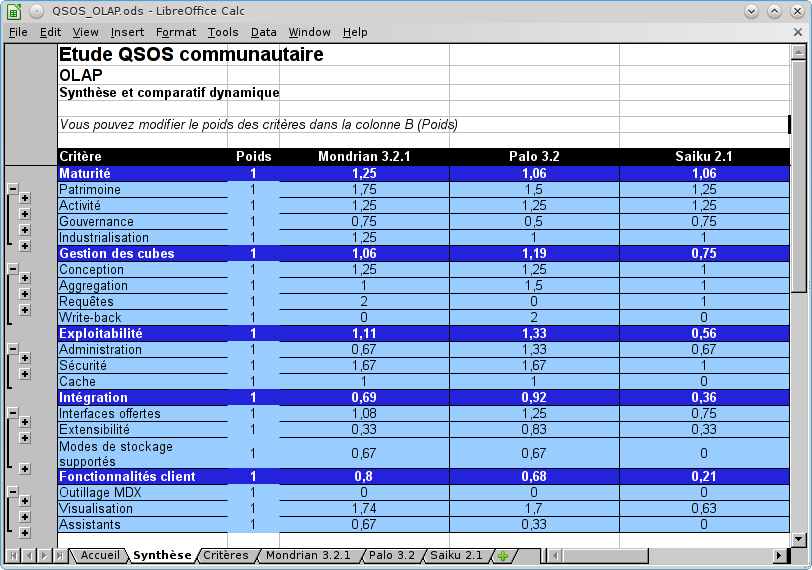
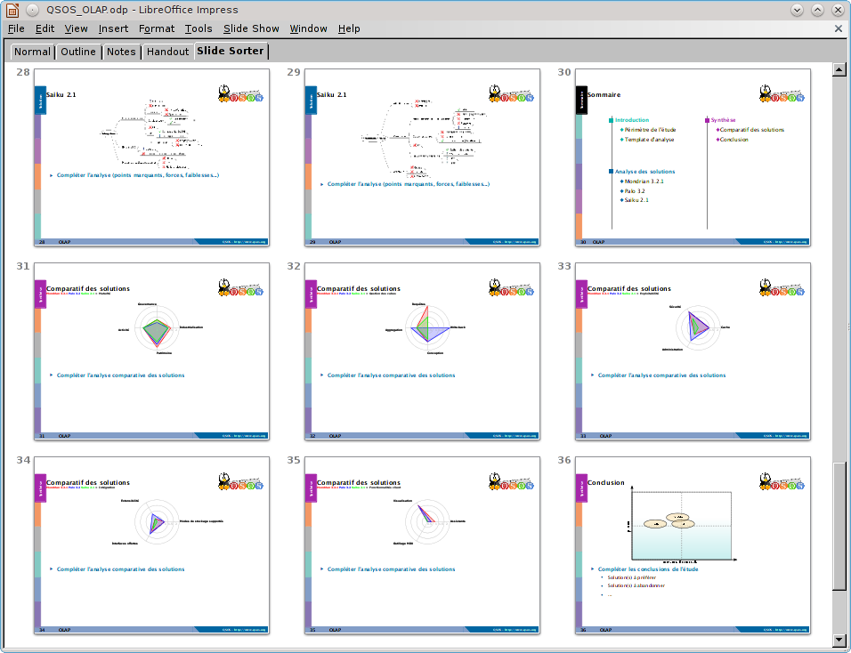

# Gérer les comparaisons

La méthode QSOS a été conçue pour comparer différents logiciels de même type, de manière à être à même de réaliser un choix judicieux. Cette comparaison entre évaluations de même template intègre le contexte de l'utilisateur sous la forme de pondérations pouvant être appliquées aux différents critères du template.

L'application Web O3S permet de réaliser des pondérations, des comparaisons et de les exporter dans différents formats.

O3S existe en deux versions, chacune connectée sur l'un des deux dépôts du référentiel QSOS :

* la version officielle^[<http://master.o3s.qsos.org/master/>], connectée au dépôt _Master_ ;

* la version « bac à sable »^[<http://incoming.o3s.qsos.org/incoming/>].

## Créer une nouvelle comparaison

Connectez-vous à l'instance d'O3S que vous désirez. La liste des évaluations de l'instance vous est affichée, filtrée par langue.

Sélectionnez le domaine logiciel qui vous intéresse. La liste des évaluations réalisées avec la version du template que vous avez sélectionnée vous est présentée.

À partir de cette page vous pouvez réaliser un certain nombre d'actions :

* visualiser dans votre navigateur une des évaluations listées aux formats XML (`.qsos`)^[Si vous utilisez Firefox et que l'extension _XulEditor_ est installée, elle vous propose alors d'ouvrir directement l'évaluation.], HTML ou FreeMind ;

* pondérer le template de manière à personnaliser votre comparaison ;

* sélectionner les évaluations à intégrer dans votre comparaison ;

* visualiser votre comparaison en mode Web sous forme de tableau HTML ou de graphique SVG ;

* exporter votre évaluation aux formats bureautiques OpenDocument.

## Pondérer une comparaison

Le bouton _Pondérer le template_ vous affiche une page permettant de gérer votre pondération.

De cette page vous pouvez :

* saisir les poids de chacun des critères du template ;

* sauvegarder en mémoire votre pondération et ainsi l'associer à la comparaison (bouton _Sauvegarder_) ;

* exporter/importer votre pondération au format XML (`.qw`) pour des fins de réutilisation (boutons _Exporter en XML_ ainsi que _Parcourir..._ et _Charger_) ;

* et enfin retourner à la page de gestion de votre comparaison (bouton _Retour_).

## Visualiser une comparaison en mode Web

Depuis la page de gestion de votre comparaison, vous pouvez visualiser cette dernière dans votre navigateur selon plusieurs modes :

* sous forme de tableau comparatif ;

* sous forme de graphiques en radar ;

* sous forme de quadrant QSOS.

### Visualiser un tableau comparatif

Le bouton _Comparatif en ligne_ déclenche l'affichage d'un tableau comparatif des évaluations que vous avez sélectionnées intégrant votre pondération.

Ce tableau est dynamique, il vous permet de réaliser les actions suivantes :

* montrer ou cacher les colonnes _Commentaires_ des différentes évaluations ;

* agrandir ou réduire la taille de police de caractères utilisée pour l'affichage ;

* basculer dans le mode de visualisation graphique sous forme de radars ;

* retourner à la page de gestion de votre comparaison (bouton _Retour_).

### Visualiser un graphique dynamique en radar

Le bouton _Comparatif graphique_ déclenche l'affichage de la comparaison sous la forme d'un graphique de type radar.

Ce graphique est dynamique, il vous permet de réaliser les actions suivantes :

* naviguer dans la comparaison en mode « _Drill Down_ » : en cliquant sur le nom des critères dont vous désirez visualiser les sous-critères ;

* naviguer dans la comparaison en mode « _Drill Back_ » : via le lien _Remonter d'un niveau_.

* retourner à la page de gestion de votre comparaison (lien _Retour_).

Notez que ce type de visualisation requiert que votre navigateur respecte le standard SVG. 

Vous pouvez enregistrer sur votre disque dur les graphiques SVG affichés par 03S en utilisant la fonction de sauvegarde de votre navigateur.

### Visualiser un quadrant QSOS

L'application O3S permet de visualiser votre comparaison selon un formalisme appelé quadrant QSOS.

Il s'agit du positionnement des différentes évaluations que vous avez sélectionnées selon deux axes :

* _Couverture fonctionnelle_ : la valeur utilisée en abscisse est la moyenne pondérée de l'ensemble des critères du template hormis ceux du nœud _Maturité_ imposé par la méthode QSOS ;

* _Maturité_ : la valeur utilisée en ordonnée est celle du nœud _Maturité_ imposé par la méthode QSOS.

Les ellipses correspondant aux logiciels évalués sont des zones cliquables qui vous redirige vers la visualisation du détail de chaque évaluation.

Notez que ce type de visualisation requiert que votre navigateur respecte le standard SVG. 

Vous pouvez enregistrer sur votre disque dur le quadrant QSOS en utilisant la fonction de sauvegarde de votre navigateur.

## Exporter une comparaison aux formats OpenDocument

Depuis la page de gestion de votre comparaison, vous pouvez l'exporter aux formats OpenDocument suivants :

* feuille de calcul : format ODS ;

* support de présentation : format ODP ;

* document textuel : format ODT.

### Exporter au format ODS

Depuis la page de gestion de votre comparaison, un clic sur le bouton _Export ODS_ déclenche la génération de l'export de votre comparaison au format _OpenDocument Spreadsheet_.

Vous pouvez sauvegarder le résultat en tant que fichier `.ods` sur votre disque dur.

La feuille de calcul exportée comporte plusieurs onglets :

* _Accueil_ : page de garde du document présentant les métadonnées de la comparaison et de son export ODS (date, version de template, présentations des onglets et note de licence) ;

* _Synthèse_ : onglet synthétisant la comparaison en termes de scores et permettant de modifier la pondération des critères ;

* _Critères_ : explication des critères utilisés pour la comparaison, basée sur les données du template ;

* un onglet par logiciel évalué : présentant le détail de l'évaluation (métadonnées, scores et commentaires).

Ce comparatif dynamique peut être utilisé de manière autonome pour personnaliser votre comparaison en modifiant sa pondération.

Notez, qu'afin de garantir l'aspect communautaire de l'effort fourni pour réaliser ce document d'export (création et modification du template, création et modification des évaluations, développement et maintenance des outils _XulEditor_ et O3S), ce dernier vous est distribué par le projet QSOS selon les termes de la licence _GNU Free Documentation License_^[<http://www.gnu.org/copyleft/fdl.html>]. 

### Exporter au format ODP

Depuis la page de gestion de votre comparaison, un clic sur le bouton _Export ODP_ déclenche la génération de l'export de votre comparaison au format _OpenDocument Presentation_.

Vous pouvez sauvegarder le résultat en tant que fichier `.odp` sur votre disque dur.

La présentation est composée de différents types de slides :

* la page de garde de la présentation ;

* des slides de sommaire pour positionner et organiser les autres slides ;

* des slides relatifs au périmètre de l'étude comparative réalisée : liste des solutions analysées, présentation du template d'analyse (cartes heuristiques FreeMind et texte explicatif pour chacun des axes principaux du template) ;

* pour chaque solution analysée, des slides détaillant son analyse (présentation du projet, cartes heuristiques et texte à compléter pour chacun des axes principaux de l'évaluation) ;

* des slides relatifs à la comparaison de ces différentes solutions (graphiques de type radar et texte à compléter pour chacun des axes principaux de l'évaluation, quadrant QSOS et texte à compléter) ;

* des slides relatif à la licence de distribution de la présentation et aux crédits à la communauté QSOS (auteurs des évaluations utilisées pour générer le squelette de la  présentation).

Il s'agit d'un squelette pouvant être utilisé pour produire un document final en saisissant votre analyse et votre synthèse dans les zones de texte à compléter.

Notez, qu'afin de garantir l'aspect communautaire de l'effort fourni pour réaliser ce document d'export (création et modification du template, création et modification des évaluations, développement et maintenance des outils _XulEditor_ et O3S), ce dernier vous est distribué par le projet QSOS selon les termes de la licence _GNU Free Documentation License_. 

### Exporter au format ODT

Depuis la page de gestion de votre comparaison, un clic sur le bouton _Export ODT_ déclenche la génération de l'export de votre comparaison au format _OpenDocument Text_.

Vous pouvez sauvegarder le résultat en tant que fichier `.odt` sur votre disque dur.

Le rapport est composé de différents chapitres : 

* _Introduction_ : chapitre présentant rapidement l'objet du document ainsi que la méthode QSOS et contenant du texte à compléter ;

* _Template d'analyse utilisé_ : présentation du template (cartes heuristiques FreeMind et texte explicatif pour chacun des axes principaux du template) ;

* _Solutions identifiées_ : présentation du périmètre de l'étude comparative et, pour chaque évaluation, détail de l'analyse réalisée (présentation du projet, cartes heuristiques et texte à compléter pour chacun des axes principaux de l'évaluation) ;

* _Synthèse_ : comparaison de ces différentes solutions (graphiques de type radar et texte à compléter pour chacun des axes principaux de l'évaluation, quadrant QSOS et texte à compléter) ;

* _Annexes_ : présentation un peu plus détaillée de la méthode QSOS ;

* _Crédits_ : citation des auteurs des évaluations utilisées pour générer le squelette du document.

Il s'agit d'un squelette pouvant être utilisé pour produire un document final en saisissant votre analyse et votre synthèse dans les zones de texte à compléter. Elle sont repérée dans le document via un format de type _surligné_.

Notez, qu'afin de garantir l'aspect communautaire de l'effort fourni pour réaliser ce document d'export (création et modification du template, création et modification des évaluations, développement et maintenance des outils _XulEditor_ et O3S), ce dernier vous est distribué par le projet QSOS selon les termes de la licence _GNU Free Documentation License_. 

