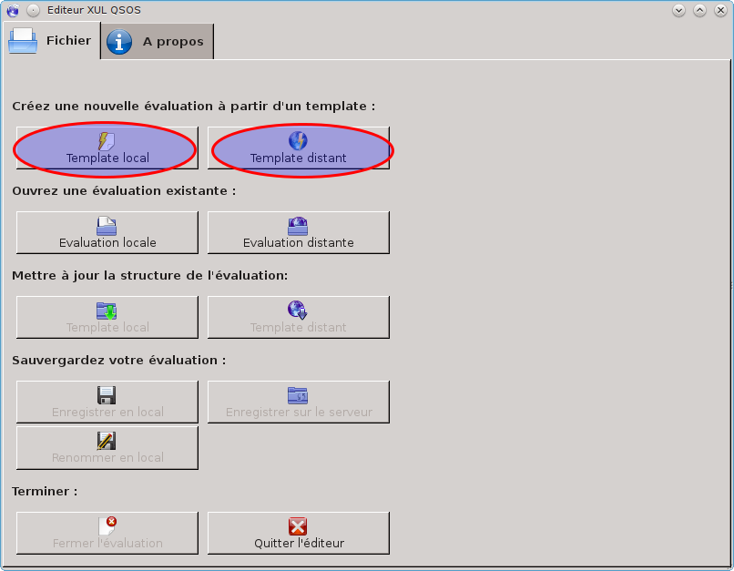
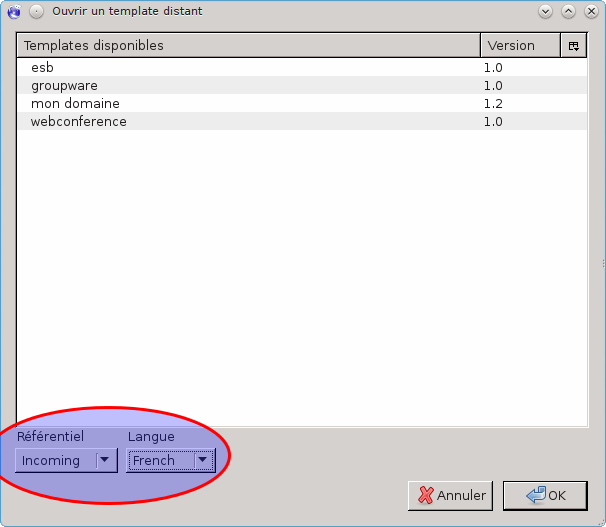
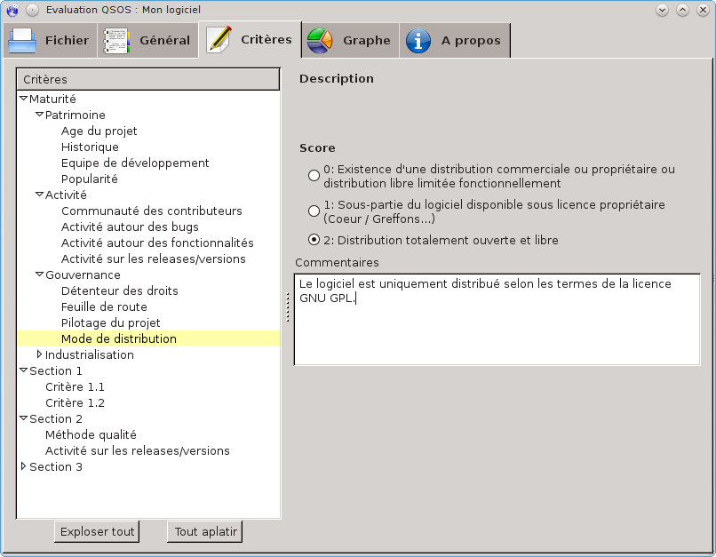
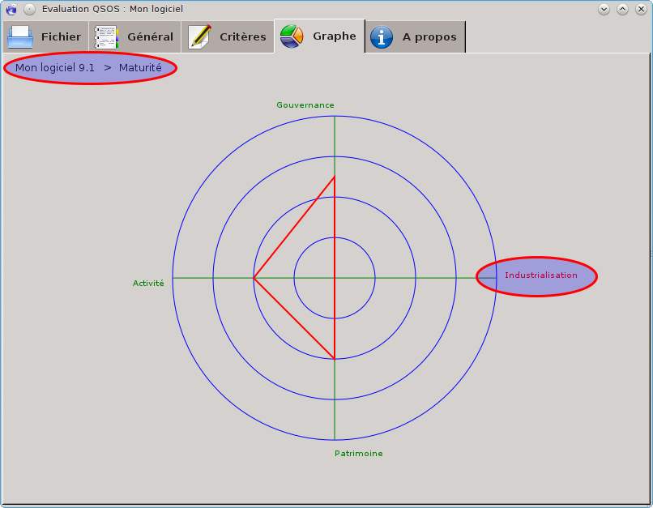
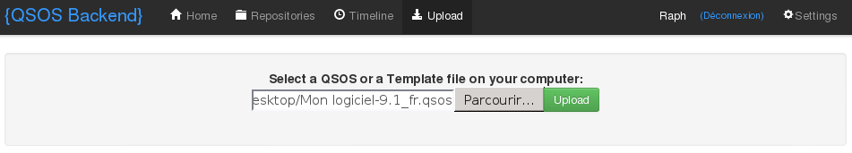
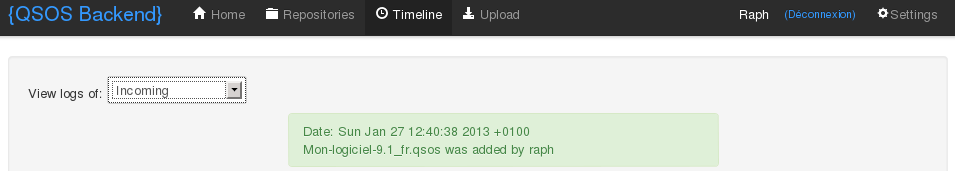
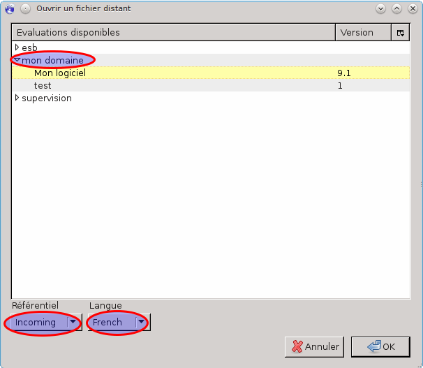
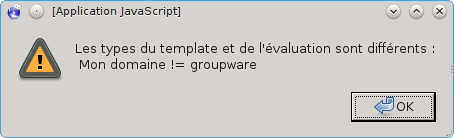
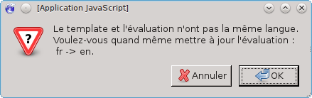
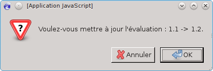

# Gérer les évaluations

## Généralités sur les évaluations

Une évaluation QSOS est basée sur un template d'une version donnée, dont elle hérite la structure et la description des critères. C'est un fichier au format `.qsos` qui est manipulé via l'outil _XulEditor_ (cf. [Installer _XulEditor_](#installer-xuleditor)).

Une évaluation basée sur une version de template peut être mise à jour par une autre version de ce même template, sans perdre les données d'évaluation existantes (cf. [Appliquer une nouvelle version de template](#appliquer-une-nouvelle-version-de-template)).

## Créer une nouvelle évaluation

### Installer _XulEditor_

_XulEditor_ peut être installé de deux manières :

* comme une extension Firefox ;

* comme une application autonome de type XulRunner.

Si le premier mode d'installation est plus simple, le deuxième offre l'avantage de permettre de lancer plusieurs instances de _XulEditor_.

#### Installer _XulEditor_ en tant qu'extension Firefox  

Il vous suffit d'ouvrir le fichier d'installation^[<http://www.qsos.org/tools/xuleditor-firefox-2.0.xpi>] depuis votre navigateur Firefox^[Au moment de la rédaction de ce tutoriel, la version la plus à jour de _XulEditor_ est la 2.0. Pensez à installer la version la plus à jour au moment où vous lisez ce tutoriel.].

Une fois l'extension installée, elle peut être lancée à partir du menu « _Outils/Editeur QSOS_ » du navigateur _Firefox_.

#### Installer _XulEditor_ en tant qu'application autonome  

Pour pouvoir utiliser _XulEditor_ en tant qu'application autonome vous devez avoir auparavant installé Mozilla Xulrunner. Reporter vous au site officiel de Mozilla^[ <https://developer.mozilla.org/en-US/docs/XULRunner>] pour le faire.

Récupérez ensuite l'archive de l'application^[<http://www.qsos.org/tools/xuleditor-application-2.0.zip>] et décompressez là où vous le désirez.

L'application _XulEditor_ peut ensuite être lancé via les scripts `xuleditor` ou `xuleditor.bat` en fonction de votre système d'exploitation.

### Utiliser _XulEditor_

Depuis l'onglet _Fichier_, vous pouvez créer une nouvelle évaluation à partir d'un template provenant soit de votre disque dur, soit du référentiel QSOS. C'est ce deuxième cas qui est détaillé ici.

Pour ce faire, cliquez sur le bouton _Template distant_ et naviguez dans le référentiel des templates QSOS.

Vous pouvez filtrer les templates du référentiel en fonction du dépôt concerné (_Master_ ou _Incoming_) et de la langue.

Une fois le template sélectionné, vous pouvez alors commencer à saisir votre évaluation en complétant les champs des différents onglets.

L'onglet _Général_ contient les informations relatives au logiciel évalué (nom, version, licence principale, etc.) et à l'évaluation elle-même (template, auteurs).

Vous remarquez que le nom et la version du template utilisés pour l'évaluation apparaissent mais ne peuvent être modifiés. Pour plus de détail sur comment mettre à jour le template d'une évaluation existante, reportez-vous au chapitre [Appliquer une nouvelle version de template](#appliquer-une-nouvelle-version-de-template).

L'onglet _Critères_ vous permet de naviguer dans l'arbre des critères d'évaluation et de les évaluer :

* en proposant un score entre 0 et 2 en fonction de la signification décrite par les auteurs du template que vous utilisez ;

* en précisant la raison et la source de votre notation.

Pensez à motiver vos scores dans le champ _Commentaires_. Cela rend votre évaluation plus pertinente, plus utile et augmente ainsi ses chances d'être rapidement validée par la communauté QSOS.

L'onglet _Graphe_ permet de naviguer de manière graphique dans l'arbre des critères, sous forme de radar où vous pouvez cliquer sur les nœuds pour en voir les sous-critères ou naviguer via le fil d'Ariane.

Les critères colorés en rouge sont ceux n'ayant pas encore été évalués. Cela vous permet de rapidement identifier les éléments manquants pour compléter votre évaluation.

### Sauvegarder une évaluation

Depuis l'onglet _Fichier_ de _XulEditor_ vous pouvez sauvegarder votre évaluation sur votre disque dur (bouton _Enregistrer en local_) pour éventuellement l'éditer plus tard (bouton _Evaluation locale_).

### Contribuer une évaluation

Lorsque vous considérez que votre évaluation est complète - au moins pour une première version, vous pouvez alors la proposer à la communauté QSOS. 

Deux méthodes sont possibles. La première est, de manière similaire aux templates, de vous connectez au backend QSOS^[<http://backend.qsos.org>]. 

Ceci nécessite de disposer d'un compte sur l'application O3S. Si vous n'en possédez pas encore, créez en sur ce même site Web.

Si vous disposez d'un compte sur 03S, vous pouvez également enregistrer votre évaluation dans le référentiel QSOS directement depuis _XulEditor_, via le bouton _Enregistrer sur le serveur_ de l'onglet _Fichier_.

À partir de ce moment, votre évaluation est visible de la communauté, dans le dépôt _Incoming_ du référentiel QSOS. Si elle est considérée comme complète et objective, elle sera validée par la communauté et déplacée dans le dépôt _Master_.

Pour contribuer une nouvelle version de votre évaluation, procédez de la même manière.

## Modifier une évaluation existante

_XulEditor_ vous permet de modifier une évaluation QSOS provenant soit de votre disque dur, soit du référentiel QSOS. C'est cette dernière méthode qui est décrite ici.

Depuis l'onglet _Fichier_, cliquez sur le bouton _Evaluation distante_. Vous pouvez alors naviguer dans le référentiel QSOS en filtrant les évaluations en fonction du type de logiciel concerné, du dépôt concerné (_Master_ ou _Incoming_) et de la langue.

Une fois l'évaluation sélectionnée, vous pouvez alors la manipuler et la modifier dans _XulEditor_.

Vous ne pouvez écraser une évaluation qui n'est pas la vôtre. Le référentiel ne l'autorise pas mais vous indique qui est l'utilisateur qui a contribué l'évaluation. Vous pouvez alors le contacter.

Si jamais vous n'arrivez pas à contacter cet utilisateur ou que vous restez sans retour de sa part, contactez un des validateurs de la communauté qui pourra alors arbitrer et vous débloquer. TODO : ajouter l'adresse de la mailing list des validateurs.

## Appliquer une nouvelle version de template

_XulEditor_ vous permet de mettre à jour le template utilisé par une évaluation. Cela permet d'injecter des évolutions apportées au niveau du template mais aussi de faciliter la traduction de l'évaluation (en appliquant un template déjà traduit).

Pour réaliser cette opération, vous devez tout d'abord ouvrir l'évaluation à mettre à jour (boutons _Evaluation locale_ ou _Evaluation distante_ de l'onglet _Fichier_). Sélectionnez ensuite la nouvelle version de template à appliquer, qu'elle provienne de votre disque dur (bouton _Template local_) ou du référentiel QSOS. C'est ce dernier cas qui est décrit ici.

Le bouton _Template distant_ vous permet ainsi de naviguez dans le référentiel des templates QSOS.

Vous pouvez filtrer les templates du référentiel en fonction du dépôt concerné (_Master_ ou _Incoming_) et de la langue.

Si vous sélectionnez un template de type différent de celui initialement utilisé pour réaliser l'évaluation, _XulEditor_ refuse de l'appliquer et vous affiche un message d'erreur. 

Si le nouveau template est dans une langue différente de celle du template initial, _XulEditor_ vous demande confirmation avant de modifier votre évaluation.

Et dans tous les cas, avant de modifier votre évaluation, _XulEditor_ vous demande confirmation.

Notez qu'il n'est pas interdit d'appliquer un template de version plus ancienne que le template actuellement utilisé.

## Visualiser une évaluation en mode Web

L'application Web O3S permet, entre autres possibilités, de visualiser les évaluations du référentiel QSOS en mode Web. Cette application offre de nombreuses autres fonctionnalités, liées aux comparaisons QSOS. Reportez-vous au chapitre [Gérer les comparaisons](#gérer-les-comparaisons) pour une description plus détaillée d'O3S.

Considérons ici que vous avez navigué dans O3S jusqu'à l'évaluation que vous désirer visualiser en mode Web. 

03S propose trois formats de visualisation d'une évaluation :

* format XML (`.qsos`) ;

* format HTML ;

* format FreeMind (`.mm`).

### Visualisation au format XML

Lorsque vous sélectionnez dans O3S ce mode de visualisation, que vous utilisez Firefox et que l'extension _XulEditor_ est installée, cette dernière vous propose alors d'ouvrir directement l'évaluation dans l'éditeur.

Dans tous les cas, le fichier XML est également affiché par votre navigateur.

### Visualisation au format HTML

Lorsque vous sélectionnez dans O3S ce mode de visualisation, l'évaluation est affichée dans votre navigateur sous forme de page HTML.

Cette page permet de plier et déplier les branches de l'arbre des critères pour faciliter la lecture de l'évaluation.

### Visualisation au format FreeMind

Lorsque vous sélectionnez dans O3S ce mode de visualisation, l'évaluation est affichée dans votre navigateur sous forme de carte heuristique au format FreeMind (`.mm`).

Cette page vous permet de réaliser les actions suivantes :

* naviguer dans l'arbre des critères évalués en cliquant sur les éléments de la carte heuristique pour les plier/déplier ;

* utiliser le menu de navigation pour réaliser une recherche par mot clé ou pour déplacer la fenêtre de visualisation par rapport à l'intégralité de la carte heuristique (en effet, certaines évaluations - une fois complètement dépliées - peuvent dépasser le cadre de la fenêtre de visualisation) ;

* utiliser le menu d'affichage pour agrandir/réduire la taille de la police de caractères, pour ajuster la taille de la carte à celle de la fenêtre de visualisation et changer la couleur du fond de la carte ;

* sauvegarder le fichier `.mm` sur votre dur, en cliquant sur le titre de la carte heuristique.

Bien qu'il s'agisse d'un fichier au format FreeMind, notez bien que vous ne visualisez pas et ne sauvegardez pas un template QSOS mais bien une représentation sous forme de carte heuristique d'une évaluation. 

Notez que ce type de visualisation requiert que votre navigateur support le format Flash.

## Migrer des evaluations du format 1.0 au format 2.0

### Migration d'un fichier unique
Une transformation XSL doit être appliquée, elle est disponible sur [GitHub](https://raw.githubusercontent.com/drakkr/QSOS/master/Tools/o3s/formats/xml/xslt/old_qsos-new_qsos.xsl) :

    xsltproc old_qsos-new_qsos.xsl MonEvalFormat1.0.qsos > MonEvalFormat2.0.qsos

### Scripts de migration et d'import de masse

Les scripts de migration et d'import suivants sont disponibles sur GitHub:

- [init.sh](https://raw.githubusercontent.com/drakkr/QSOS/master/Tools/o3s/init.sh): réinitialise le backend O3S (database, Git et fichiers), à utiliser avec précaution donc!
- [old_qsos-new_qsos.sh](https://raw.githubusercontent.com/drakkr/QSOS/master/Tools/o3s/old_qsos-new_qsos.sh): met à jour d'anciennes évaluations QSOS (du format 1.0 au format 2.0) puis les importe et les valide au sein du backend O3S, les fichiers d'import doivent être stockés dans `app/backend/app/upload`
