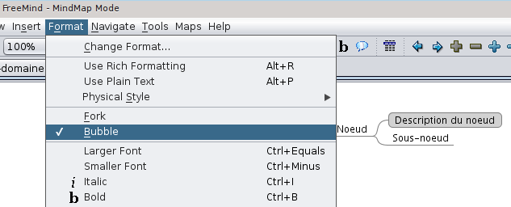
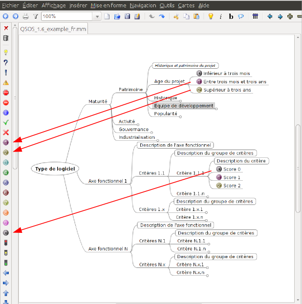
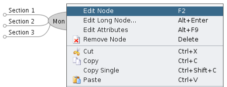
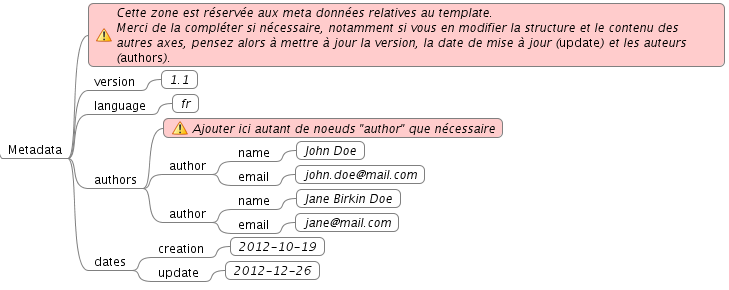
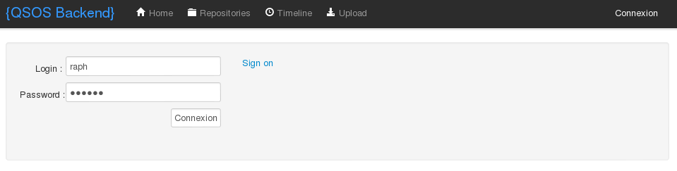
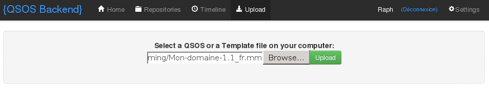
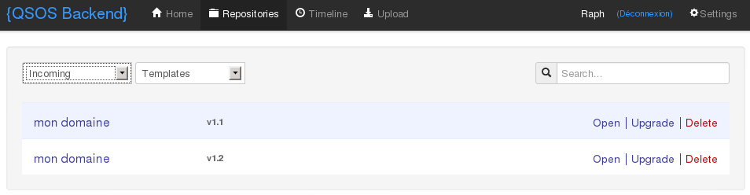

# Gérer les templates

## Généralités sur les templates

Un template définit la structure ou la grille d'analyse d'une évaluation QSOS. Il est constitué de critères répartis sous forme d'arbre selon plusieurs axes. 

Les axe intitulés _Maturité_ et _Metadata_ sont imposés par la méthode QSOS. 

L'axe _Maturité_  est un ensemble organisé de critères systématiquement utilisé pour évaluer la maturité du logiciel et du projet en charge de son développement. Et ce, quel que soit le logiciel ou le type de logiciel concernés. Pour le détail des critères composant l'axe _Maturité_, consultez la méthode QSOS elle-même. Ainsi, même si vous modifiez cet axe dans votre template, ces modifications seront écrasées pour garantir sa conformité avec la méthode.

L'axe _Medatata_ est décrit plus loin au chapitre [Modifier l'axe _Metadata_](#modifier-laxe-metadata).

Il est réservé à la gestion d'un ensemble d'informations propres au template lui-même (métadonnées), telles que ses auteurs, sa version, sa date de création, sa dernière date de modification ou encore sa langue.

## Créer un nouveau template

### Installer FreeMind

Le logiciel libre FreeMind est utilisé pour créer et modifier les templates sous forme de cartes heuristiques (ou _MindMaps_). Il s'agit d'un logiciel développé en Java et donc utilisable sur un grand nombre de plates-formes. Prière de vous reporter à la documentation officielle du projet^[<http://freemind.sourceforge.net/wiki/index.php/Documentation>] pour le détail de son installation.

Attention cependant, la version minimale de FreeMind requise par QSOS est 0.9.0.

### Récupérer le souche du template

Pour créer un nouveau template, il vous faut absolument partir de la souche correspondant à votre langue. 

Ces souches respectent la convention de nommage suivante : `template_[langue].mm`. Ainsi, la souche française est `template_fr.mm`.

Elles sont publiées sur le site officiel du projet QSOS, à l'adresse suivante : <http://backend.qsos.org>.

### Ajouter des axes d'évaluation

Une fois la souche téléchargée, ouvrez le document `.mm` avec FreeMind. Vous retrouvez les deux axes imposés par QSOS : _Maturité_ et _Metadata_.

Pour ajouter de nouveaux axes d'évaluation à votre template, il vous suffit d'ajouter et organiser des nœuds de manière hiérarchique, tout en respectant impérativement le formalisme suivant :

* un nœud intermédiaire permet d'organiser et hiérarchiser vos critères, outre son titre, vous pouvez préciser sa description détaillée via un sous-nœud mis au format _Bulle_.

* un nœud final (donc une feuille), correspond à un critère d'évaluation, il doit respecter les conventions suivantes :

    1. les descriptions des critères doivent là aussi être entourées ;

    2. les descriptions des notes 0, 1 et 2 doivent être repérées via des icônes idoines.

Libre à vous de créer et d'organiser les critères d'évaluation propres à une famille de logiciel. Le nœud principal de votre template doit être nommé selon cette famille, c'est ce nom qui identifie le template de manière unique.

### Modifier l'axe _Metadata_

Pensez à modifier l'axe _Metadata_ de votre template en précisant les informations suivantes :

* _version_ : incrémentez cette valeur (selon le formalisme `n.m`) à chaque modification devant être reportée sur des évaluations QSOS existantes ;

* _language_ : langue de votre template (selon le formalisme `fr`, `en`, etc.) ;

* _author_ : auteurs du templates, identifiés par leurs noms complets (_name_) et leur courriel (_email_) ;

* _creation_ : date de création du template (selon le formalisme `AAAA-MM-JJ`) ;

* _update_ : date de la dernière modification du template.

### Modifier l'axe _Maturité_

Il vous est impossible de modifier cet axe qui est imposé par la méthode QSOS. Même si vous modifiez les critères obtenus via la souche de votre template, ces modifications seront écrasées par la suite.

### Sauvegarder le template

Le fichier FreeMind de votre template est au format `.mm`. Vous pouvez donc le sauvegarder et le manipuler à votre guise.

### Contribuer le template

Lorsque vous considérez que le template est complet - au moins pour une première version, vous pouvez alors le proposer à la communauté QSOS. Pour ce faire, connectez vous à l'adresse suivante : <http://o3s.qsos.org/backend/app/connect.php>. 

Ceci nécessite de disposer d'un compte sur l'application O3S. Si vous n'en possédez pas encore, créez en un en cliquant sur le lien _Sign On_.

À partir de ce moment, votre template est utilisable par la communauté pour créer de nouvelles évaluations. Reportez-vous au chapitre [Créer une nouvelle évaluation](#créer-une-nouvelle-évaluation).

Le template est automatiquement stocké dans le dépôt _Incoming_ du référentiel QSOS. S'il est considéré de bonne qualité, il sera validé par la communauté et déplacé dans le dépôt _Master_.

Pour contribuer une nouvelle version de votre template, procédez de la même manière (en vérifiant de bien incrémenter la valeur du nœud _version_ de l'axe _Metadata_).

## Modifier un template existant

Les templates déjà existants sont stockés dans le référentiel communautaire de QSOS. Ils sont regroupés dans deux dépôts Git distincts :

* le dépôt *Incoming* : réservé à la publication, au partage et à la manipulation d'évaluations et de templates par la communauté. Il est accessible par tous via O3S et seule la création d'un compte utilisateur dans l'application est nécessaire ;

* le dépôt *Master* : dédié au stockage des évaluations et aux templates considérés comme de qualité et ayant été validés par un modérateur de la communauté QSOS.

Vous pouvez, en vous connectant à 03S^[<http://o3s.qsos.org/backend/app/listRepo.php>], naviguer dans ces deux dépôts et télécharger les templates de votre choix.

Une fois un template récupéré, utilisez _FreeMind_ pour le modifier. Reportez-vous au chapitre [Créer un nouveau template](#créer-un-nouveau-template) pour plus de détails sur ce sujet.

## Régénérer un template depuis une évaluation existante

Il est possible de régénérer une souche de template en appliquant une transformation XSL à une évaluation existante.
Le fichier `eval-to-template.xsl` est stocké sur [GitHub](https://raw.githubusercontent.com/drakkr/QSOS/master/Tools/o3s/formats/xml/xslt/eval-to-template.xsl).

Pour appliquer la transformation XSL sous Linux, la commande `xsltproc` est requise (`apt get install xsltproc` pour l'installer sous Debian) :

	xsltproc eval-to-template.xsl existing_valuation.qsos > template.mm

Reste ensuite à éditer le fichier `.mm` avec _FreeMind_ pour compléter ou mettre à jour, si nécessaire, l'axe _Metadata_.
Si l'évaluation existante est dans un format `.qsos` antérieur à la version 2, accepter la proposition de _FreeMind_ de mettre à jour le format du fichier `template.mm` généré. 