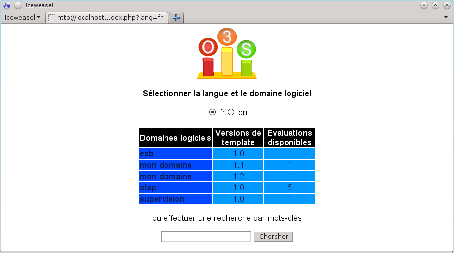
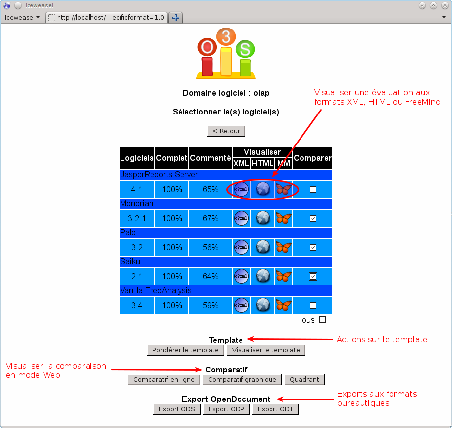
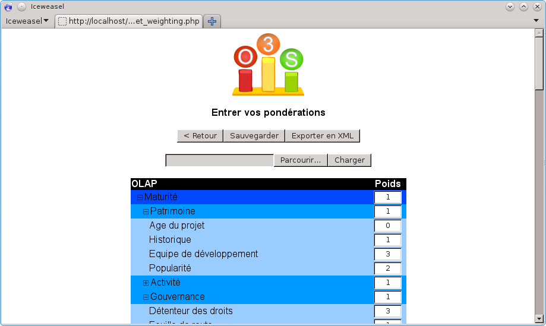
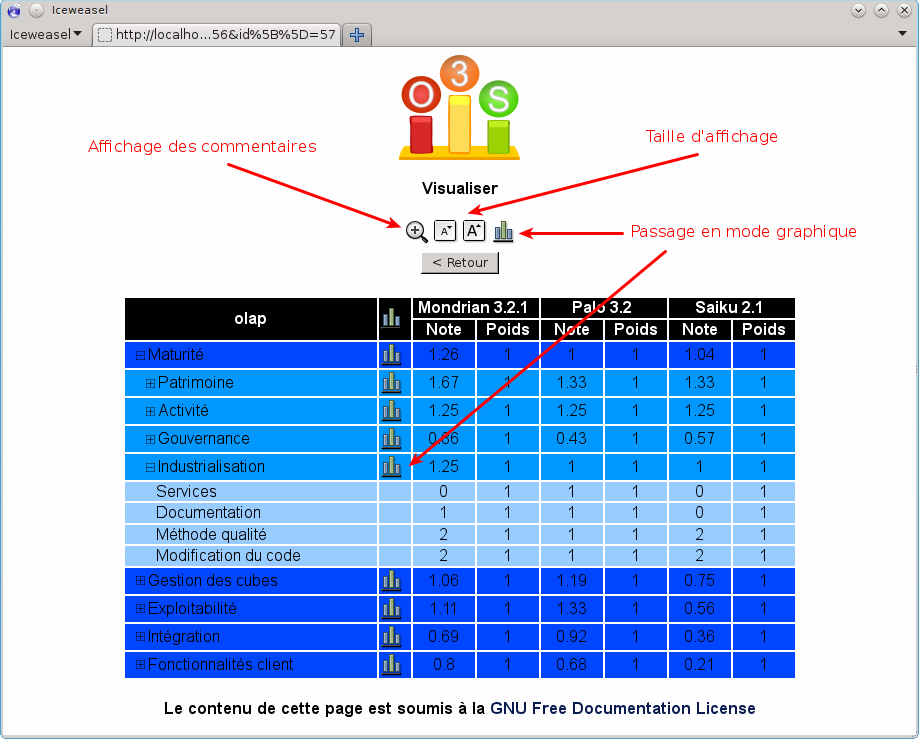
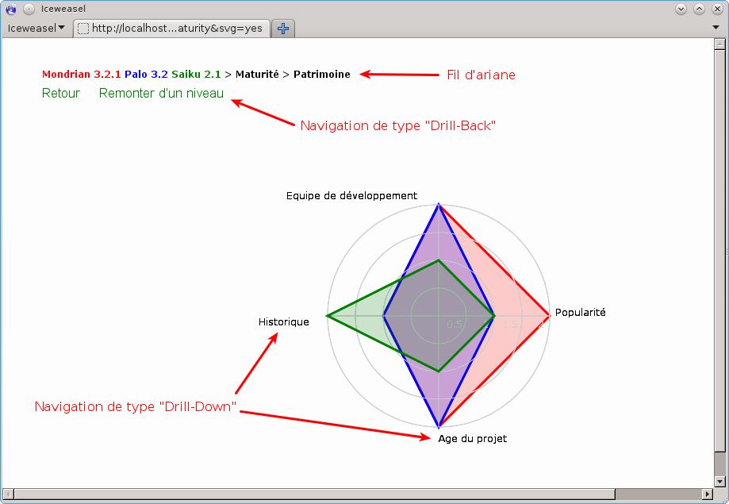
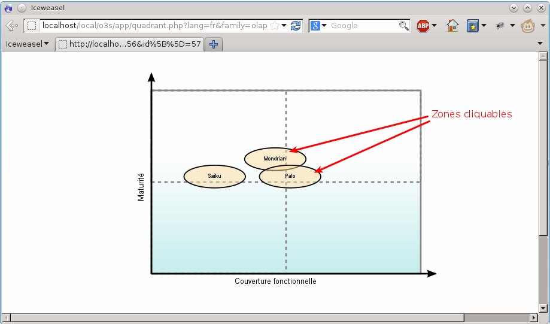
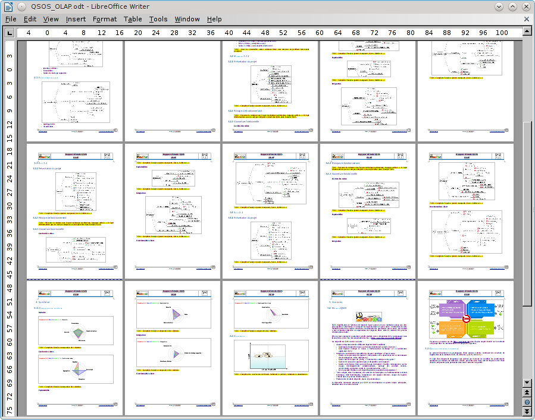

% Tutoriel QSOS
% 
% Version 2.0 - 26/01/2013

# Note de licence

Copyright © 2013 Atos.

Vous pouvez copier, redistribuer et/ou modifier ce document selon les termes de la Licence de Documentation Libre GNU, Version 1.2 publiée par la Free Software Foundation. Une copie de la licence en langue anglaise est consultable sur le site <http://www.gnu.org/copyleft/fdl.html>, une traduction française non officielle est consultable sur le site Web de Wikipedia (<http://fr.wikipedia.org/wiki/FDL>). 

# Historique des modifications

---------------------------------------------------------------------------
 Version   Date       Auteurs           Commentaires
--------- ----------  ----------------- -----------------------------------
  2.0      26/01/13   Raphaël Semeteys  Conception et rédaction initiales.
--------------------------------------- -----------------------------------

# Introduction

L'objectif de ce tutoriel est de vous guider dans l'application de la démarche proposée par la méthode QSOS en utilisant les outils mis à votre disposition par le projet communautaire.

Ainsi ce tutoriel est constitué d'un ensemble de cas d'usage auxquels vous pouvez être confrontés. Ces cas d'usage ne se présentent pas toujours forcément dans l'ordre dans lequel ils sont listés ici, vous pouvez donc utiliser le tutoriel soit comme un scénario complet, soit comme une liste à consulter en fonction de vos besoins.

# Gérer les templates

## Généralités sur les templates

Un template définit la structure ou la grille d'analyse d'une évaluation QSOS, il est constitué de critères répartie sous forme d'arbre selon plusieurs axes. 

L'axe intitulé _Maturité_ est imposé par la méthode QSOS. 

Il s'agit donc d'un ensemble organisé de critères systématiquement utilisé pour évaluer la maturité du logiciel et du projet en charge de son développement. Et ce, quel que soit le logiciel ou le type de logiciel concernés. Pour le détail des critères composant l'axe _Maturité_, consultez la méthode QSOS elle-même. Ainsi, même si vous modifiez cet axe dans votre template, ces modifications seront écrasées pour garantir sa conformité avec la méthode.

Un template comporte également un deuxième axe obligatoire, nommé _Medatata_ et décrit plus loin au chapitre [Modifier l'axe _Metadata_](#modifier-laxe-metadata).

Il est réservé à la gestion d'un ensemble d'informations propres au template lui-même, telles que ses auteurs, sa version, sa date de création, sa dernière date de modification ou encore sa langue.

## Créer un nouveau template

### Installer FreeMind

Le logiciel libre FreeMind est utilisé pour créer et modifier les templates sous forme de cartes heuristiques (ou _MindMaps_). Il s'agit d'un logiciel développé an langage Java et donc utilisable sur un grand nombre de plates-formes. Prière de vous reporter à la documentation officielle du projet^[<http://freemind.sourceforge.net/wiki/index.php/Documentation>] pour le détail de son installation.

Attention cependant, la version minimale de FreeMind requise par QSOS est 0.9.0.

### Récupérer le souche du template

Pour créer un nouveau template, il vous faut absolument partir de la souche correspondant à votre langue. 

Ces souches respectent la convention de nommage suivante : `bootsrap_[langue].mm`. Ainsi, la souche française est `bootsrap_fr.mm`.

Elles sont publiées sur le site officiel du projet QSOS, à l'adresse suivante : __TODO__.

### Ajouter des axes d'évaluation

Une fois la souche téléchargée, ouvrez le document `.mm` avec FreeMind. Vous retrouvez les deux axes imposés par QSOS : _Maturité_ et _Metadata_.

Pour ajouter de nouveaux axes d'évaluation à votre template, il vous suffit d'ajouter et organiser des nœuds de manière hiérarchique, tout en respectant impérativement le formalisme suivant :

* un nœud intermédiaire permet d'organiser et hiérarchiser vos critères, outre son titre, vous pouvez préciser sa description détaillée via un sous-nœud mis au format _Bubble_.

* un nœud final (donc une feuille), correspond à un critère d'évaluation, il doit respecter les conventions suivantes :

    1. les descriptions des critères doivent là aussi être entourées ;

    2. les descriptions des notes 0, 1 et 2 doivent être repérées via des icônes idoines.

Libre à vous de créer et organiser les critères d'évaluation propres à une famille de logiciel. Le nœud principal de votre template doit être nommé selon cette famille, c'est ce nom qui identifie le template de manière unique.

### Modifier l'axe _Metadata_

Pensez à modifier l'axe _Metadata_ de votre template en précisant les informations suivantes :

* _version_ : incrémentez cette valeur (selon le formalisme `n.m`) à chaque modification devant être reportée sur des évaluations QSOS existantes ;

* _language_ : langue de votre template (selon le formalisme `fr`, `en`, etc.) ;

* _author_ : auteurs du templates, identifiés par leurs noms complets (_name_) et leur courriel (_email_) ;

* _creation_ : date de création du template (selon le formalisme `AAAA-MM-JJ`) ;

* _update_ : date de la dernière modification du template.

### Modifier l'axe _Maturité_

Il vous est impossible de modifier cet axe qui est imposé par la méthode QSOS. Même si vous modifiez les critères obtenus via la souche de votre template, ces modifications seront écrasées par la suite.

### Sauvegarder le template

Le fichier FreeMind de votre template est au format `.mm`. Vous pouvez donc le sauvegarder et le manipuler à votre guise.

### Contribuer le template

Lorsque vous considérez que le template est complet - au moins pour une première version, vous pouvez alors le proposer à la communauté QSOS. Pour ce faire, connectez vous à l'adresse suivante : <http://o3s.qsos.org/backend/app/connect.php>. 

Ceci nécessite de disposer d'un compte sur l'application O3S. Si vous n'en possédez pas encore, créez en un en cliquant sur le lien _Sign On_.

À partir de ce moment, votre template est utilisable par la communauté pour créer de nouvelles évaluations. Reportez-vous au chapitre [Créer une nouvelle évaluation](#créer-une-nouvelle-évaluation).

Le template est automatiquement stocké dans le dépôt _Incoming_ du référentiel QSOS. Si il est considéré de bonne qualité, il sera validé par la communauté et déplacé dans le dépôt _Master_.

Pour contribuer une nouvelle version de votre template, procédez de la même manière (en vérifiant de bien incrémenter la valeur du nœud _version_ de l'axe _Metadata_).

## Modifier un template existant

Les templates déjà existants sont stockés dans le référentiel communautaire de QSOS. Ils sont regroupés dans deux dépôts Git distincts :

* le dépôt *Incoming* : réservé à la publication, au partage et à la manipulation d'évaluations et de templates par la communauté, il est accessible par tous via O3S et ne requiert uniquement de créer un compte utilisateur dans l'application ;

* le dépôt *Master* : dédié au stockage des évaluations et aux templates considérés comme de qualité et ayant été validés par un modérateur de la communauté QSOS.

Vous pouvez, en vous connectant à 03S^[<http://o3s.qsos.org/backend/app/listRepo.php>], naviguer dans ces deux dépôts et télécharger les templates de votre choix.

Une fois un template récupéré, utilisez _FreeMind_ pour le modifier. Reportez-vous au chapitre [Créer un nouveau template](#créer-un-nouveau-template) pour plus de détails sur ce sujet.

# Gérer les évaluations

## Généralités sur les évaluations

Une évaluation QSOS est basée sur un template d'une version donnée, dont elle hérite la structure et la description des critères. C'est un fichier au format `.qsos` qui est manipulé via l'outil _XulEditor_ (cf. [Installer _XulEditor_](#installer-xuleditor)).

Une évaluation basée sur une version de template peut être mise à jour par une autre version de ce même template, sans perdre les données d'évaluation existantes (cf. [Appliquer une nouvelle version de template](#appliquer-une-nouvelle-version-de-template)).

## Créer une nouvelle évaluation

### Installer _XulEditor_

_XulEditor_ peut être installé de deux manières :

* comme une extension Firefox ;

* comme une application autonome de type XulRunner.

Si le premier mode d'installation est plus simple, le deuxième offre l'avantage de permettre de lancer plusieurs instances de _XulEditor_.

#### Installer _XulEditor_ en tant qu'extension Firefox  

Il vous suffit d'ouvrir le fichier d'installation^[<http://www.qsos.org/tools/xuleditor-firefox-2.0.xpi>] depuis votre navigateur Firefox^[Au moment de la rédaction de ce tutoriel, la version la plus à jour de _XulEditor_ est la 2.0, pensez à installer la version la plus à jour au moment où vous lisez ce tutoriel.].

Une fois l'extension installée, elle peut être lancée à partir du menu « _Outils/Editeur QSOS_ » du navigateur _Firefox_.

#### Installer _XulEditor_ en tant qu'application autonome  

Pour pouvoir utiliser _XulEditor_ en tant qu'application autonome vous devez avoir auparavant installé Mozilla Xulrunner. Reporter vous au site officiel de Mozilla^[ <https://developer.mozilla.org/en-US/docs/XULRunner>] pour le faire.

Récupérez ensuite l'archive de l'application^[<http://www.qsos.org/tools/xuleditor-application-2.0.zip>] et décompressez là où vous le désirez.

L'application _XulEditor_ peut ensuite être lancé via les scripts `xuleditor` ou `xuleditor.bat`en fonction de votre système d'exploitation.

### Utiliser _XulEditor_

Depuis l'onglet _Fichier_, vous pouvez créer une nouvelle évaluation à partir d'un template provenant soit de votre disque dur, soit du référentiel QSOS. C'est ce deuxième cas qui est détaillé ici.

Pour ce faire, cliquez sur le bouton _Template distant_ et naviguez dans le référentiel des templates QSOS.

Vous pouvez filtrer les templates du référentiel en fonction du dépôt concerné (_Master_ ou _Incoming_) et de la langue.

Une fois le template sélectionné, vous pouvez alors commencer à saisir votre évaluation en complétant les champs des différents onglets.

L'onglet _Général_ contient les informations relatives à logiciel évalué (nom, version, licence principale, etc.) et à l'évaluation elle-même (template, auteurs).

Vous remarquez que le nom et la version du template utilisés pour l'évaluation apparaissen mais ne peuvent être modifiés. Pour plus de détail sur comment mettre à jour le template d'une évaluation existante, reportez-vous au chapitre [Appliquer une nouvelle version de template](#appliquer-une-nouvelle-version-de-template).

L'onglet _Critères_ vous permet de naviguer dans l'arbre des critères d'évaluation et de les évaluer :

* en proposant un score entre 0 et 2 en fonction de la signification décrite par les auteurs du template que vous utilisez ;

* en précisant la raison et la source de votre notation.

Pensez à motiver vos scores dans le champ _Commentaires_ cela rend votre évaluation plus pertinente, plus utile et ainsi augmente ses chances d'être rapidement validée par la communauté QSOS.

L'onglet _Graphe_ permet de naviguer de manière graphique dans l'arbre des critères, sous forme de radar où vous pouvez cliquer sur les nœuds pour en voir les sous-critères ou naviguer via le fil d'Ariane.

Les critères colorés en rouge sont ceux n'ayant pas encore été évalués. Cela vous permet de rapidement identifier où compléter votre évaluation.

### Sauvegarder une évaluation

Depuis l'onglet _Fichier_ de _XulEditor_ vous pouvez sauvegarder votre évaluation sur votre disque dur (bouton _Enregister en local_) pour éventuellement l'éditer plus tard (bouton _Evaluation locale_).

### Contribuer une évaluation

Lorsque vous considérez que votre évaluation est complète - au moins pour une première version, vous pouvez alors la proposer à la communauté QSOS. 

Deux méthodes sont possibles. La première est, de manière similaire aux templates, de vous connectez à l'application 03S^[TODO : <http://o3s.qsos.org/backend/app/upload.php>]. 

Ceci nécessite de disposer d'un compte sur l'application O3S. Si vous n'en possédez pas encore, créez en sur ce même site Web.

Si vous disposez d'un compte sur 03S, vous pouvez également enregistrer votre évaluation dans le référentiel QSOS directement depuis _XulEditor_, via le bouton _Enregistrer sur le serveur_ de l'onglet _Fichier_.

À partir de ce moment, votre évaluation est visible de la communauté, dans le dépôt _Incoming_ du référentiel QSOS. Si elle est considérée comme complète et objective, elle sera validée par la communauté et déplacée dans le dépôt _Master_.

Pour contribuer une nouvelle version de votre évaluation, procédez de la même manière.

## Modifier une évaluation existante

_XulEditor_ vous permet de modifier une évaluation QSOS provenant soit de votre disque dur, soit du référentiel QSOS. C'est cette dernière méthode qui est décrite ici.

Depuis l'onglet _Fichier_, cliquez sur le bouton _Evaluation distante_. Vous pouvez alors naviguer dans le référentiel QSOS en filtrant les évaluations en fonction du type de logiciel concerné, du dépôt concerné (_Master_ ou _Incoming_) et de la langue.

Une fois l'évaluation sélectionnée, vous pouvez alors la manipuler et la modifier dans _XulEditor_.

Vous ne pouvez écraser une évaluation qui n'est pas la vôtre, le référentiel ne l'autorise pas mais vous indique qui est l'utilisateur qui a contribué l'évaluation. Vous pouvez alors le contacter.

Si jamais vous n'arrivez pas à contacter cet utilisateur ou que vous restez sans retour de sa part, contactez un des validateurs de la communauté qui pourra alors arbitrer et vous débloquer. TODO : ajouter l'adresse de la mailing list des validateurs.

## Appliquer une nouvelle version de template

_XulEditor_ vous permet de mettre à jour le template utilisé par une évaluation, cela permet d'injecter des évolutions apportées au niveau du template mais aussi de faciliter la traduction de l'évaluation (en appliquant un template déjà traduit).

Pour réaliser cette opération, vous devez tout d'abord ouvrir l'évaluation à mettre à jour (boutons _Evaluation locale_ ou _Evaluation distante_ de l'onglet _Fichier_). Sélectionnez ensuite la nouvelle version de template à appliquer, qu'elle provienne de votre disque dur (bouton _Template local_) ou du référentiel QSOS. C'est ce dernier cas qui est décrit ici.

Le bouton _Template distant_ vous permet ainsi de naviguez dans le référentiel des templates QSOS.

Vous pouvez filtrer les templates du référentiel en fonction du dépôt concerné (_Master_ ou _Incoming_) et de la langue.

Si vous sélectionnez un template de type différent de celui initialement utilisé pour réaliser l'évaluation, _XulEditor_ refuse de l'appliquer et vous affiche un message d'erreur. 

Si le nouveau template est dans une langue différente de celle du template initial, _XulEditor_ vous demande confirmation avant de modifier votre évaluation.

Et dans tous les cas, avant de modifier votre évaluation, _XulEditor_ vous demande confirmation.

Notez qu'il n'est pas interdit d'appliquer un template de version plus ancienne que le template actuellement utilisé.

## Visualiser une comparaison en mode Web

L'application Web O3S permet, entre autres possibilités de visualiser les évaluations du référentiel QSOS en mode Web. Cette application offre de nombreuses autres fonctionnalités, liées aux comparaisons QSOS. Reportez-vous au chapitre [Gérer les comparaisons](#gérer-les-comparaisons) pour une description plus détaillée d'O3S.

Considérons ici que vous avez navigué dans O3S jusqu'à l'évaluation que vous désirer visualiser en mode Web. 

03S propose trois formats de visualisation d'une évaluation :

* format XML (`.qsos`) ;

* format HTML ;

* format FreeMind (`.mm`).

### Visualisation au format XML

Lorsque vous sélectionnez dans O3S ce mode de visualisation, que vous utilisez Firefox et que l'extension _XulEditor_ est installée, cette dernière vous propose alors d'ouvrir directement l'évaluation dans l'éditeur.

Dans tous les cas, le fichier XML est également affiché par votre navigateur.

### Visualisation au format HTML

Lorsque vous sélectionnez dans O3S ce mode de visualisation, l'évaluation est affichée dans votre navigateur sous forme de page HTML.

Cette page permet de plier et déplier les branches de l'arbre des critères pour faciliter la lecture de l'évaluation.

### Visualisation au format FreeMind

Lorsque vous sélectionnez dans O3S ce mode de visualisation, l'évaluation est affichée dans votre navigateur sous forme de carte heuristique au format FreeMind (`.mm`).

Cette page vous permet de réaliser les actions suivantes :

* naviguer dans l'arbre des critères évalués en cliquant sur les éléments de la carte heuristique pour les plier/déplier ;

* utiliser le menu de navigation pour réaliser une recherche par mot clé ou pour déplacer la fenêtre de visualisation par rapport à l'intégralité de la carte heuristique (en effet, certaines évaluations - une fois complètement dépliées - peuvent dépasser le cadre de la fenêtre de visualisation) ;

* utiliser le menu d'affichage pour agrandir/réduire la taille de la police de caractères, pour ajuster la taille de la carte à celle de la fenêtre de visualisation et changer la couleur du fond de la carte ;

* sauvegarder le fichier `.mm` sur votre dur, en cliquant sur le titre de la carte heuristique.

Bien qu'il s'agisse d'un fichier au format FreeMind, notez bien que vous ne visualisez et sauvegardez pas un template QSOS mais bien une représentation sous forme de carte heuristique d'une évaluation. 

Notez que ce type de visualisation requiert que votre navigateur support le format Flash.

# Gérer les comparaisons

La méthode QSOS a été conçue pour comparer différents de logiciels de même type, de manière à être à même de réaliser un choix. Cette comparaison entre évaluations de même template intègre le contexte de l'utilisateur sous la forme de pondérations pouvant être appliquées aux différents critères du template.

L'application Web O3S permet de réaliser des pondérations, des comparaisons et de les exporter dans différents formats.

O3S existe en deux versions, chacune connectée sur l'un des deux dépôts du référentiel QSOS :

* la version officielle^[TODO : <http://o3s.qsos.org/master/>], connectée au dépôt _Master_ ;

* la version « bac à sable »^[TODO : <http://o3s.qsos.org/incoming/>].

## Créer une nouvelle comparaison

Connectez-vous à l'instance d'O3S que vous désirez. La liste des évaluations de l'instance vous est affichée, filtrée par langue.

Sélectionnez le domaine logiciel qui vous intéresse. La liste des évaluations réalisées avec la version du template que vous avec sélectionnée vous est présentée.

À partir de cette page vous pouvez réaliser un certain nombre d'actions :

* visualiser dans votre navigateur une des évaluations listées aux formats XML (`.qsos`)^[Si vous utilisez Firefox et que l'extension _XulEditor_ est installée, elle vous propose alors d'ouvrir directement l'évaluation.], HTML ou FreeMind ;

* pondérer le template de manière à personnaliser votre comparaison ;

* sélectionner les évaluations à intégrer dans votre comparaison ;

* visualiser votre comparaison en mode Web sous forme de tableau HTML ou de graphique SVG ;

* exporter votre évaluation aux formats bureautiques OpenDocument.

## Pondérer une comparaison

Le bouton _Pondérer le template_ vous affiche une page permettant de gérer votre pondération.

De cette page vous pouvez :

* saisir les poids de chacun des critères du template ;

* sauvegarder en mémoire votre pondération et ainsi l'associer à la comparaison (bouton _Sauvegarder_) ;

* exporter/importer votre pondération au format XML (`.qw`) pour des fins de réutilisation (boutons _Exporter en XML_ ainsi que _Parcourir..._ et _Charger_) ;

* et enfin retourner à la page de gestion de votre comparaison (bouton _Retour_).

## Visualiser une comparaison en mode Web

Depuis la page de gestion de votre comparaison, vous pouvez visualiser cette dernière dans votre navigateur selon plusieurs modes :

* sous forme de tableau comparatif ;

* sous forme de graphiques en radar ;

* sous forme de quadrant QSOS.

### Visualiser un tableau comparatif

Le bouton _Comparatif en ligne_ déclenche l'affichage d'un tableau comparatif des évaluations que vous avez sélectionnées intégrant votre pondération.

Ce tableau est dynamique, il vous permet de réaliser les actions suivantes :

* montrer ou cacher les colonnes _Commentaires_ des différentes évaluations ;

* agrandir ou réduire la taille de police de caractères utilisée pour l'affichage ;

* basculer dans le mode de visualisation graphique sous forme de radars ;

* retourner à la page de gestion de votre comparaison (bouton _Retour_).

### Visualiser un graphique dynamique en radar

Le bouton _Comparatif graphique_ déclenche l'affichage de la comparaison sous la forme d'un graphique de type radar.

Ce graphique est dynamique, il vous permet de réaliser les actions suivantes :

* naviguer dans la comparaison en mode « _Drill Down_ » : en cliquant sur le nom des critères dont vous désirez visualiser les sous-critères ;

* naviguer dans la comparaison en mode « _Drill Back_ » : via le lien _Remonter d'un niveau_.

* retourner à la page de gestion de votre comparaison (lien _Retour_).

Notez que ce type de visualisation requiert que votre navigateur respecte le standard SVG. 

Vous pouvez enregistrer sur votre disque dur les graphiques SVG affichés par 03S en utilisant la fonction de sauvegarde de votre navigateur.

### Visualiser un quadrant QSOS

L'application O3S permet de visualiser votre comparaison selon un formalisme appelé quadrant QSOS.

Il s'agit du positionnement des différentes évaluations que vous avez sélectionnées selon deux axes :

* couverture fonctionnelle : la valeur utilisée en abscisse est la moyenne pondérée de l'ensemble des critères du templates hormis ceux du nœud _Maturité_ imposé par la méthode QSOS ;

* Maturité : la valeur utilisée en ordonnée est celle du nœud _Maturité_ imposé par la méthode QSOS.

Les ellipses correspondant aux logiciels évalués sont des zones cliquables qui vous redirige vers la visualisation du détail de chaque évaluation.

Notez que ce type de visualisation requiert que votre navigateur respecte le standard SVG. 

Vous pouvez enregistrer sur votre disque dur le quadrant QSOS en utilisant la fonction de sauvegarde de votre navigateur.

## Exporter une comparaison aux formats OpenDocument

Depuis la page de gestion de votre comparaison, vous pouvez l'exporter aux formats OpenDocument suivants :

* feuille de calcul : format ODS ;

* support de présentation : format ODP ;

* document textuel : format ODT.

### Exporter au format ODS

Depuis la page de gestion de votre comparaison, un clic sur le bouton _Export ODS_ déclenche la génération de  l'export de votre comparaison au format _OpenDocument Spreadsheet_.

Vous pouvez sauvegarder le résultat en tant que fichier `.ods` sur votre disque dur.

La feuille de calcul exportée comporte plusieurs onglets :

* Accueil : page de garde du document présentant les métadonnées de la comparaison et de son export ODS (date, version de template, présentations des onglets et note de licence) ;

* Synthèse : onglet synthétisant la comparaison en termes de scores et permettant de modifier la pondération des critères ;

* Critères : explication des critères utilisés pour la comparaison, basée sur les données du template ;

* un onglet par logiciel évalué : présentant le détail de l'évaluation (métadonnées, scores et commentaires).

Ce comparatif dynamique peut être utilisé de manière autonome pour personnaliser votre comparaison en modifiant sa pondération.

Notez, qu'afin de garantir l'aspect communautaire de l'effort fourni pour réaliser ce document d'export (création et modification du template, création et modification des évaluations, développement et maintenance des outils _XulEditor_ et O3S), ce dernier vous est distribué par le projet QSOS selon les termes de la licence _GNU Free Documentation License_^[<http://www.gnu.org/copyleft/fdl.html>]. 

### Exporter au format ODP

Depuis la page de gestion de votre comparaison, un clic sur le bouton _Export ODP_ déclenche la génération de l'export de votre comparaison au format _OpenDocument Presentation_.

Vous pouvez sauvegarder le résultat en tant que fichier `.odp` sur votre disque dur.

La présentation est composée de différents types de slides :

* la page de garde de la présentation ;

* des slides de sommaire pour positionner et organiser les autres slides ;

* des slides relatifs au périmètre de l'étude comparative réalisée : liste des solutions analysées, présentation du template d'analyse (cartes heuristiques FreeMind et texte explicatif pour chacun des axes principaux du template) ;

* pour chaque solution analysée, des slides détaillant sont l'analyse (présentation du projet, cartes heuristiques et texte à compléter pour chacun des axes principaux de l'évaluation) ;

* des slides relatifs à la comparaison de ces différentes solutions (graphiques de type radar et texte à compléter pour chacun des axes principaux de l'évaluation, quadrant QSOS et texte à compléter) ;

* des slides relatif à la licence de distribution de la présentation et aux crédits à la communauté QSOS (auteurs des évaluations utilisées pour générer le squelette de la  présentation).

Il s'agit d'un squelette pouvant être utilisé pour produire un document final en saisissant votre analyse et votre synthèse dans les zones de texte à compléter.

Notez, qu'afin de garantir l'aspect communautaire de l'effort fourni pour réaliser ce document d'export (création et modification du template, création et modification des évaluations, développement et maintenance des outils _XulEditor_ et O3S), ce dernier vous est distribué par le projet QSOS selon les termes de la licence _GNU Free Documentation License_. 

### Exporter au format ODT

Depuis la page de gestion de votre comparaison, un clic sur le bouton _Export ODT_ déclenche la génération de l'export de votre comparaison au format _OpenDocument Text_.

Vous pouvez sauvegarder le résultat en tant que fichier `.odt` sur votre disque dur.

La présentation est composée de différents chapitres : 

* Introduction : chapitre présentant rapidement l'objet du document ainsi que la méthode QSOS et contenant du texte à compléter ;

* Template d'analyse utilisé : présentation du template (cartes heuristiques FreeMind et texte explicatif pour chacun des axes principaux du template) ;

* Solutions identifiées : présentation du périmètre de l'étude comparative et, pour chaque évaluation, détail de l'analyse réalisée (présentation du projet, cartes heuristiques et texte à compléter pour chacun des axes principaux de l'évaluation) ;

* Synthèse : comparaison de ces différentes solutions (graphiques de type radar et texte à compléter pour chacun des axes principaux de l'évaluation, quadrant QSOS et texte à compléter) ;

* Annexes : présentation un peu plus détaillée de la méthode QSOS ;

* Crédits : citation des auteurs des évaluations utilisées pour générer le squelette du document.

Il s'agit d'un squelette pouvant être utilisé pour produire un document final en saisissant votre analyse et votre synthèse dans les zones de texte à compléter. Elle sont repérée dans le document via un format de type _Stabylo_.

Notez, qu'afin de garantir l'aspect communautaire de l'effort fourni pour réaliser ce document d'export (création et modification du template, création et modification des évaluations, développement et maintenance des outils _XulEditor_ et O3S), ce dernier vous est distribué par le projet QSOS selon les termes de la licence _GNU Free Documentation License_. 

