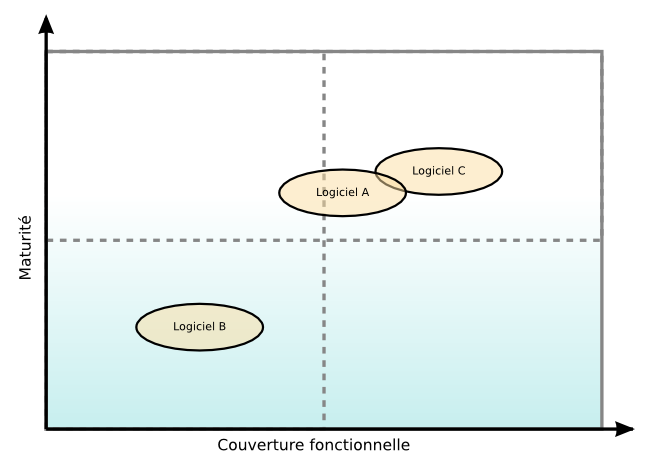
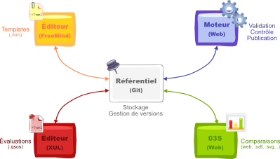
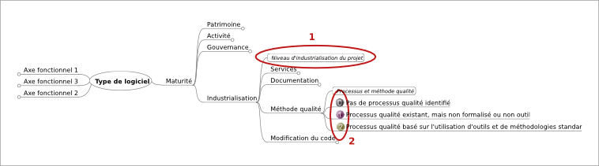

% Qualification et Sélection de logiciels Open Source (QSOS)
% 
% Version 2.0 - 19/01/2013

# Note de licence

Copyright © 2004-2013 Atos.

Vous pouvez copier, redistribuer et/ou modifier ce document selon les termes de la Licence de Documentation Libre GNU, Version 1.2 publiée par la Free Software Foundation ; la Section Invariante étant « Manifeste QSOS », et aucun Texte de Première de Couverture et aucun Texte de Quatrième de Couverture. 

Une copie de la licence en langue anglaise est consultable sur le site <http://www.gnu.org/copyleft/fdl.html>, une traduction française non officielle est consultable sur le site Web de Wikipedia (<http://fr.wikipedia.org/wiki/FDL>). 
La licence s'applique également aux documents générés par l'application de la méthode, à savoir les grilles fonctionnelles et les fiches d'évaluation présentées dans la section « Évaluer ».

# Manifeste QSOS

##  De la nécessité d'une méthode

Pour une entreprise, le choix d'opter pour un logiciel comme composant de son système d'information, que ce logiciel soit Open Source ou commercial, repose sur l'analyse des besoins et contraintes (techniques, fonctionnels et stratégiques) puis de l'adéquation du logiciel à ces besoins et aux contraintes exprimés.

Toutefois, dès lors que l'on envisage d'étudier l'adéquation de logiciels Open Source, il est nécessaire de disposer d'une méthode de qualification et de sélection adaptée aux spécificités de ce type de logiciels. En effet, il est, par exemple, tout particulièrement important d'examiner précisément les contraintes et les risques spécifiques à la nature même de ces logiciels. Le domaine de l'Open Source étant très vaste et très riche, il est aussi nécessaire de disposer d'une méthode de qualification permettant de bien différencier les différents logiciels candidats à un besoin, souvent très nombreux, tant sur les aspects techniques et fonctionnels que stratégiques.

En plus des questions « naturelles » comme :

* Quel logiciel répond le mieux à mes besoins techniques actuels et prévus ?

* Quel logiciel répond le mieux à mes besoins fonctionnels actuels et prévus ?

* Voici quelques questions que devrait se poser toute entreprise avant de prendre une décision :

    + Quelle est la pérennité du logiciel ? Quels sont les risques de Forks ? Comment les anticiper et les gérer ?

    + Quel est le niveau de stabilité auquel s'attendre ? Comment gérer les dysfonctionnements ?

    + Quel est le niveau de support requis et disponible sur le logiciel ?

    + Est-il possible d'influer sur le logiciel (ajout de nouvelles fonctionnalités ou de fonctionnalités spécifiques) ?

Pour pouvoir répondre sereinement à ce type d'interrogations et ainsi faire un choix éclairé en maîtrisant les risques, il est impératif de disposer d'une méthode offrant la possibilité :

* de qualifier un logiciel en intégrant les spécificités de l'Open Source ;

* de comparer plusieurs logiciels en fonction de besoins formalisés et de critères pondérés pour être à même d'effectuer un choix final.

Ce sont ces différents points qui ont poussé Atos à concevoir et formaliser la méthode de Qualification et de Sélection de logiciels Open Source (QSOS).

## De la nécessité d'une méthode libre

Selon nous, une telle méthode ainsi que les résultats qu'elle génère, se doivent d'être mis à disposition de tous selon une licence libre. En effet, seule une telle licence est à même de garantir la promotion du mouvement open source, via notamment :

* la possibilité de réutilisation par tous des travaux de qualification et d'évaluation réalisés ;
* la qualité et l'objectivité des documents générés, toujours perfectibles selon les principes de transparence et de revue par les pairs.

A ce titre, Atos a décidé de placer la méthode QSOS et les documents générés lors de son application (templates et fiches d'évaluation) sous la licence libre *GNU Free Documentation License*. Les outils développés pour faciliter l'application de la méthode étant quant à eux distribués selon les termes de la licence *GNU General Public License*.

# Historique des modifications

--------------------------------------------------------------------------------------
 Version   Date       Auteurs                  Commentaires
--------- ----------  --------------------     ---------------------------------------
  1.0      2004       Raphaël Semeteys         Conception et rédaction initiales.
  
  1.1      2004       Olivier Pilot            Conception et relecture.
  
  1.2      2004       Laurent Baudrillard      Conception et relecture.
  
  1.3      17/11/04   Raphaël Semeteys         Première version publique.
  
  1.4      23/11/05   Raphaël Semeteys         Note de licence. Historique.
                      Olivier Pilot            Nouveau logo.
			     
  1.5      19/01/06   Gonéri Le Bouder         Passage à LaTeX. Licence GNU FDL.
                      Raphaël Semeteys         Manifeste QSOS.
			     
  1.6      13/04/06   Gonéri Le Bouder         Mise à jour de l'axe Maturité.
  
  2.0      19/01/13   Raphaël Semeteys         Passage à Markdown. Formats et outils.
                      Philippe-Arnaud Haranger Mise à jour de l'axe Maturité.
--------------------------------------------------------------------------------------

# Introduction
## Objet du document

Ce document présente la méthode, baptisée « QSOS » (Qualification et Sélection de logiciels Open Source), conçue par Atos pour qualifier et sélectionner les logiciels Open Source dans le cadre de ses travaux de support et de veille technologique.

La méthode peut s'intégrer dans le cadre plus général d'un processus de veille technologique qui n'est pas présenté ici, et décrit un processus de constitution des fiches d'identité et d'évaluation de logiciels libres.

## Public visé

Le présent document vise les publics suivants :

* les personnes curieuses de se documenter sur la méthode à titre professionnel comme personnel ;

* les communautés des projets Open Source ;

* les experts du secteur informatique désirant connaître et appliquer la méthode dans leur travail quotidien d'évaluation et de sélection de composants dans l'optique de bâtir des solutions logicielles répondant à leurs besoins ou à ceux de leurs clients.

# Processus général

## Quatre étapes

Le processus général de QSOS se décompose en plusieurs étapes interdépendantes.

-----------------------------------------------------------------------------------------------------
 Étape         Description
-------------  --------------------------------------------------------------------------------------
 Définir       Constitution et enrichissement des référentiels utilisés par les autres étapes.
  
 Évaluer       Évaluation d'une version de logiciel (couverture fonctionnelle et maturité du projet).
  
 Qualifier     Pondération de l'évaluation en fonction du contexte.
  
 Sélectionner  Comparaison et sélection de logiciels, basées sur les données des étapes précédentes.
-----------------------------------------------------------------------------------------------------

Chacune de ces étapes est détaillée plus loin dans ce document.
 
## Processus itératif

Le processus général présenté peut être appliqué avec des granularités différentes. Cela permet de s'adapter au niveau de détail souhaité dans le processus de qualification et de sélection ainsi que de procéder par boucles itératives pour affiner chacune des quatre étapes.

# Étape 1 : Définir

## Objectif

L'objectif de cette étape est de définir différents éléments de typologie réutilisés par les trois étapes suivantes du processus général.

Les différents référentiels typologiques concernés sont les suivants :

* types de logiciels : classification hiérarchique de types de logiciels et description des couvertures fonctionnelles associées à chaque type sous forme de templates ;

* types de licences : classification des types de licences libres et Open Source utilisées ;

* types de communautés : classification des types d'organisations communautaires existant autour d'un logiciel Open Source pour en assurer le cycle de vie.

## Référentiel des types de logiciels

Il s'agit du référentiel qui évolue le plus car, au fur et à mesure que les logiciels évoluent, ils offrent de nouvelles fonctionnalités qu'il est nécessaire d'y ajouter.

Les templates constituant ce référentiel sont composés de critères organisés de manière hiérarchique. Ils sont regroupés selon plusieurs axes d'analyse :

* analyse de la maturité du projet en charge du développement du logiciel ;

* analyse de de la couverture fonctionnelle du logiciel.

La méthode QSOS définit et impose les critères d'évaluation de la maturité d'un projet. 

Ces critères doivent obligatoirement être utilisés dans toute évaluation QSOS. Ils sont détaillés en annexe du présent document.

Les autres critères d'évaluation sont spécifiques au domaine fonctionnel auquel appartiennent les logiciels évalués.

Consultez le site Web <http://www.qsos.org> pour le détail des templates disponibles ainsi que pour être guidé dans la construction de nouveaux templates d'évaluation.

## Référentiel des types de Licences

Il existe de nombreuses licences libres et open source, ce réfrentiel a pour objectif de les identifier et de les catégoriser selon les axes suivants :

* propriétarisation : le code dérivé peut-il être rendu propriétaire ou doit-il rester libre ?

* persistance : l'utilisation du code du logiciel à partir d'un autre module se traduit-il ou non par la nécessité que ce module soit placé sous la même licence ?

* héritage : le code dérivé hérite-il obligatoirement de la licence où est-il possible d'y appliquer des restrictions supplémentaires ?

Le tableau suivant liste les licences les plus souvent utilisées en les comparant par rapport aux critères énoncés plus haut.

Licence                   Propriétarisation    Perstance   Héritage 
------------------------ ------------------- ------------ ----------
GNU Public License              Non              Oui         Oui 
CeCILL                          Non              Oui         Oui 
LGPL                            Non           Partielle      Oui 
BSD et dérivées                 Oui              Non         Non 
Artistic                        Oui              Non         Non 
MIT                             Oui              Non         Non 
Apache Software License         Oui              Non         Non 
Mozilla Public License          Non              Non         Oui 
Common Public License           Non              Non         Non 
Academic Free License           Oui              Non         Non 
PHP License                     Oui              Non         Non 
Open Software License           Non              Non         Non 
Zope Public License             Oui              Non         Non 
Python SF License               Oui              Non         Non 

 Vous pouvez vous reporter au projet projet __SLIC__^[<http://slic.drakkr.org>] (Software LIcense Comparator) pour une description plus complète et plus formelle des licences libres et open source ainsi que de leur compatibilités respectives.

Il convient de noter qu'un même logiciel peut être assujetti à plusieurs licences différentes (y compris propriétaires).

## Référentiel des types de communautés

Les types de communautés identifiés à ce jour sont :

* développeur isolé : le logiciel est développé et géré par une seule personne ;

* groupe de développeurs : plusieurs personnes travaillant ensemble de manière informelle ou pas fortement industrialisée ;

* organisation de développeurs : il s'agit d'un groupe de développeurs utilisant un mode de gestion du cycle de vie du logiciel formalisé et respecté, généralement basé sur l'attribution de rôles (développeur, validateur, responsable de livraison...) et la méritocratie ;

* entité légale : une entité légale, en général à but non lucratif, chapeaute la communauté pour généralement prendre en charge la détention des droits d'auteur ou gérer le sponsorat et les subventions associées ;

* entité commerciale : une entité commerciale emploie les développeurs principaux du projet et se rémunère sur la vente de services ou de versions commerciales du logiciel.

# Étape 2 : Évaluer

## Objectif

L'objectif de cette étape est de procéder à l'évaluation des logiciels Open Source. Elle consiste à récupérer des informations depuis la communauté Open Source, de manière à noter le logiciel selon des critères définis lors de l'étape précédente. Cette grille d'analyse ou template est donc un arbre de critères.

Ce travail d'évaluation est insérable dans une démarche plus large de veille technologique qui n'est pas décrite ici dans sa globalité.

## Evaluation d'une version de logiciel

Chaque version d'un logiciel est décrite dans une fiche d'évaluation. Cette fiche comporte, outre l'identification du logiciel et de sa version, des informations une description et une analse détaillées des fonctionnalités offertes.

### Templates d'évaluation

Les évaluations QSOS sont réalisées à partir de templates qui décrivent les différents critères d'analyse ainsi que leur structuration. Les critères d'évaluation de la maturité du projet développant un logiciel sont imposés et décrit plus loin. Ils sont complétés par des critères décrivant les fonctionnalités attendues du type de logiciel évalué.

### Notation

Les critères sont notés de 0 à 2. 

Les templates d'évaluation contiennent les significations des trois notes 0, 1 et 2 des critères à évaluer. Au niveau de la couverture fonctionnelle, la règle de notation est généralement la suivante :

  Note    Description
-------   ------------------
  0       Fonctionnalité non couverte.
  1       Fonctionnalité partiellement couverte.
  2       Fonctionnalité totalement couverte.

Ces notes serviront, lors de l'étape de sélection, à comparer et filtrer les logiciels en fonction des pondérations précisées lors de l'étape de qualification des besoins de l'utilisateur.

Il est possible d'appliquer le processus global de manière itérative. Au niveau de l'évaluation, cela se traduit par la possibilité de noter les critères en plusieurs fois, en calquant le niveau de détail sur celui de l'évaluation réalisée. Cela permet ainsi de ne pas bloquer le déroulement du processus général lorsque l'on ne dispose pas de l'intégralité des notes. Une fois tous les critères évalués, les notes des deux premiers niveaux sont alors recalculées par moyenne pondérée des notes attribuées ou calculées aux niveaux précédents.

# Étape 3 : Qualifier

## Objectif

L'objectif de cette étape est de définir un ensemble d'éléments traduisant les besoins et les contraintes liés à la démarche de sélection d'un logiciel Open Source. Il s'agit ici de qualifier le contexte dans lequel il est envisagé d'utiliser le logiciel libre, de manière à obtenir un filtre utilisé par la suite dans l'étape « Sélectionner » du processus général.

## Filtres

### Filtre sur l'identité

Un premier niveau de filtrage peut être posé au niveau des données relatives à l'identité des logiciels. Il peut s'agir, par exemple, de ne considérer que les logiciels d'un type donné du référentiel, ou n'état distribué selon les termes d'un licence donnée.

### Filtre sur la maturité du projet
Le degré de pertinence de chaque critère de maturité est positionné en fonction du contexte :

* critère non pertinent, à ne pas intégrer au filtre ;

* critère pertinent ;

* critère critique.

Cette pertinence sera traduite par une valeur numérique de pondération à l'étape suivante du processus en fonction du mode de sélection utilisé.

### Filtre sur la couverture fonctionnelle

Chaque fonctionnalité décrite dans le template d'évaluation est affectée d'un niveau d'exigence, choisi parmi les suivants :

* fonctionnalité requise ;

* fonctionnalité optionnelle ;

* fonctionnalité non requise.

Ces exigences seront associées à des valeurs de pondération lors de l'étape « Sélectionner », en fonction du mode de sélection retenu.

# Étape 4 : Sélectionner

## Objectif

L'objectif de cette étape est de sélectionner le ou les logiciels correspondant aux besoins de l'utilisateur, ou plus généralement de comparer des logiciels du même type.

## Modes de sélection

Deux modes de sélection sont possibles :

* la sélection stricte ;

* la sélection souple.

### Sélection stricte

La sélection stricte se base sur un processus d'élimination directe dès qu'un logiciel ne répond pas aux exigences formulées dans l'étape :

* élimination des logiciels ne correspondant pas au filtre sur la fiche d'identité ;

* élimination des logiciels n'offrant pas les fonctionnalité requises par le filtre sur la couverture fonctionnelle ;

* élimination des logiciels dont les critères de maturité ne satisfont pas aux pertinences définies par ou avec l'utilisateur :

    + la note d'un critère pertinent doit être au moins égale à 1 ;
 
    + la note d'un critère critique doit être au moins égale à 2.

Cette méthode est très sélective et peut, en fonction du niveau d'exigence de l'utilisateur, ne retourner aucun logiciel éligible.

Les logiciels ayant passé la sélection sont ensuite affectés d'une note globale déterminée par pondération, de la même manière que dans la sélection souple.

### Sélection souple

Cette méthode est moins stricte que la précédente car plutôt que d'éliminer les logiciels non éligibles au niveau de la couverture fonctionnelle ou de la maturité, elle se contente de les classer tout en mesurant l'écart constaté par rapport aux filtres définis précédemment.

Elle se base sur des valeurs de pondération dont les règles d'attribution sont détaillées dans les paragraphes suivants.

__Pondération fonctionnelle__

La valeur de pondération se base sur le niveau d'exigence de chaque fonctionnalité de l'axe de la couverture fonctionnelle.

Niveau d'exigence              Pondération
---------------------------- ---------------
Fonctionnalité requise           3
Fonctionnalité optionnelle       1
Fonctionnalité non requise       0

__Pondération sur la maturité__

La valeur de pondération se base sur le degré de pertinence de chaque critère de maturité.

Niveau d'exigence              Pondération
---------------------------- ---------------
Critère critique                3
Critère pertinent               1
Critère non pertinent           0

### Comparaison

Les logiciels d'un même domaine peuvent également être comparés entre eux selon les notes pondérées obtenues lors des étapes précédentes.

Les figures suivantes illustrent ce qu'il est alors possible d'obtenir en synthèse. L'application O3S, présentée plus loin, permet d'exporter les comparaisons dans différent formats (OpenDocument, HTML et SVG).

# Le projet QSOS

## Un projet libre et communautaire

Outre le fait de proposer un méthode, QSOS constitue un projet libre et communautaire voué à la veille technologique collaborative sur les logiciels open source.

Ainsi, les principaux objectifs du projet sont les suivants :

* gérer les évolutions de la méthode et du format de stockage des fiches d'évaluations ;

* centraliser les référentiels et notamment le stockage des templates, des fiches d'identité et des fiches d'évaluations ;

* fournir des outils pour faciliter l'application de la méthode QSOS ;

* assister les utilisateurs dans l'utilisation de la méthode via des bonnes pratiques et des espaces de communication.

## Outils et format utilisés

Le projet libre QSOS propose également des outils pour dérouler le processus de la méthode et faciliter la collaboration autour des évaluations réalisées, ainsi que des formats de document pour stocker et manipuler les templates et les évaluations.

Le schéma ci-dessous présente et positionne les différents outils et formats existants.

### Templates

__Outil FreeMind__

Les templates sont des grilles de couverture fonctionnelle propres à chaque domaine logiciel. Avant de pouvoir réaliser une évaluation d’un logiciel donné, il faut donc disposer du template adapté.

Le projet QSOS utilise des cartes heuristiques (ou *mindmap*) pour concevoir et documenter ses templates. Le choix a été fixé sur la solution libre FreeMind^[<http://freemind.sourceforge.net>] du fait de sa portabilité et de son format XML permettant la transformation des templates au format `.qsos`, décrit plus bas, via une transormation XSL.

__Format `.mm`__

Les templates d'évaluations sont décrits et stockés au format défini et utilisé par FreeMind (extension `.mm`).

Ce format est décrit sur le site officiel du projet. Il s'agit d'un format XML qui est utilisé par QSOS comme format pivot en ce qui concerne les templates. Les fiches d'évaluations vierges utilisées pour réaliser des analyses QSOS de logiciels sont générées à partir de ce format via des transformation XSL.

Les cartes heuristiques représentant des templates QSOS doivent respecter un formalisme particulier pour pouvoir être transformées en fiches d'évaluation :

1. les descriptions des critères doivent être entourées (menu « Format/Bubble » de FreeMind) ;

2. les descriptions des notes 0, 1 et 2.

Le fichier XSL permettant de transformer les templates en fiches d'évaluations est disponible sur le site Web du projet QSOS. FreeMind permet d'appliquer la transformation via le menu « File/Export/Using XSLT... ».

### Evaluations

__Outil XulEditor__

XulEditor est un outil de saisie et de gestion d'évaluations QSOS. Il permet de réaliser les opérations suivantes :

* créer une nouvelle évaluation à partir d'un template au format `.mm` (template local ou provenant du référentiel QSOS) ;

* ouvrir et modifier un éveluation existante (évaluation locale ou provenant du référentiel QSOS) ;

* appliquer une nouvelle version de template à une évaluation (sans perdre les données d'évaluations existantes) ;

* sauvegarder une évaluation (en local ou dans le référentiel QSOS).

XulEditor ne permet donc pas de modifier un template `.mm` et ne manipule que des évaluations au format `.qsos`.

Il s'agit d'une application utilisant la plateforme technologique du projet Mozilla. Elle peut être déployée en tant qu'extention au navigateur Firefox ou en tant qu'application XulRunner. 

Reportez-vous au site Web du projet QSOS pour plus de détails sur l'installation de XulEditor.

__Outil O3S (Open Source Selection Software)__

O3S est application Web permettant de visualiser, pondérer et comparer les évaluations QSOS selon le processus décrit dans la méthode. Elle permet de visualiser, comparer, exporter les évaluations QSOS au format OpenDocument, ainsi que générer des graphes au format SVG. 

Elle est accessible en ligne à l'adresse suivante : <http://www.qsos.org/o3s/>.

Il est également possible d'installer une instance d'O3S locale à votre organisation. Reportez-vous au site Web du projet QSOS pour plus de détails sur ce sujet.

__Format `.qsos`__

Les évaluations sont décrites et stockées dans un format pivot XML spécifique à QSOS. Le schéma XML est disponible sur le site Web du projet QSOS. Ce chapitre en décrit les principes de structuration.  
L'extension des fichiers est `.qsos`.

La balise principale est `<document/>`, elle est constituée ainsi :

* un entête `<header>` contenant les métadonnées liées de la fiche d'évaluation (auteurs de l'évaluation, langue, template utilisé, versions de QSOS et du template, dates de création et de validation...) ;

* un ou plusieurs axes (`<section/>`) de critères d'évaluation :

    + eux-mêmes composés de critères d'évaluation (`<element/>`) pouvant être imbriqués les uns dans les autres, et des descriptions (`<desc/>`) ;
    
    + dans cet arbre de balises, les critères situés au plus profond de la hiérarchie contiennent les significations liées aux notes 0, 1 et 2 (`<desc0/>`, `<desc1/>` et `<desc2/>`), la note d'évaluation (`<score/>`) ainsi qu'une zone de commentaire pour justifier plus précisément la note (`<comment/>`).
    
Ci-suit une illustration de cette structuration :

~~~ {.xml}
<?xml version="1.0" encoding="UTF-8"?>
<document>
   <header>
      <authors>
         <author>
            <name>Nom d'un auteur de l'évaluation</name>
            <email>Email de l'auteur</email>
         </author>
         <!-- Autres <author/> éventuels -->	 
      </authors>
      <dates>
         <creation>Date de création</creation>
         <validation>Date de validation</validation>
      </dates>
      <appname>Nom du logiciel</appname>
      <desc>Description rapide du logiciel</desc>
      <release>Version du logiciel</release>
      <licenseid>Identifiant de la licence principale</licenseid>
      <licensedesc>Nom de la licence principale</licensedesc>
      <url>URL du site Web du logiciel</url>
      <demourl>URL du site Web de démonstration</demourl>
      <language>Langue d'évaluation : en, fr...</language>
      <qsosappname>Identifiant CPE de la version</qsosappname>
      <qsosformat>Format de QSOS utilisé, ici : 2.0</qsosformat>
      <qsosspecificformat>Version du template</qsosspecificformat>
      <qsosappfamily>Nom du template d'évaluation</qsosappfamily>
   </header>
   <section name="maturity" title="Maturité">
      <!-- <section/> imposée et versionnée par QSOS -->     
   </section>     
   <section name="Identifiant-unique-1" title="Nom de la section">
      <element name="Identifiant-unique-2" title="Nom du critère">
         <desc>Description du critère</desc>
         <element name="Identifiant-unique-3" title="Nom du sous-critère">
         <desc>Description du sous-critère</desc>
            <desc0>Signification de la note 0</desc0>
            <desc1>Signification de la note 1</desc1>
            <desc2>Signification de la note 2</desc2>
            <score>Notation du critère : 0, 1 ou 2</score>
            <comment>Commentaire motivant la note</comment>
         </element>
         <!-- Autres <element/> éventuels -->
      </element>
      <!-- Autres <element/> éventuels -->
   </section>
   <!-- Autres <section/> éventuelles -->
</document>
~~~

Il s'agit donc d'un arbre XML composé d'un entête (`<header/>`) et de sections (`<section/>`) contenant des éléments (`<element/>`). Les feuilles de cet arbre sont des critères d'évaluation pouvant être notés _0_, _1_ ou _2_.

Ce format est utilisé comme pivot par les outils proposé par le projet QSOS pour réaliser des exports dans d'autres formats XML, tels que HTML, SVG ou encore OpenDocument.

La structure détaillée de ce format est décrite au sein d'un schéma XSD, disponible sur le site Web du projet QSOS.

__Moteur et référentiel QSOS__

Le moteur QSOS consiste en une série d’outils pour valider, contrôler et publier les évaluations et les templates QSOS stockées dans le référentiel.

Le référentiel est décomposé en deux dépôts Git dédiés aux stockage de deux d'évaluations et de templates :

* le dépôt *Incoming* : réservé à la publication, au partage et à la manipulation d'évaluations et de templates par la communauté, il est accessible par tous via O3S et ne requiert uniquement de créer un compte utilisateur dans l'application ;

* le dépôt *Master* : dédié au stockage des évaluations et aux templates considérés comme de qualité et ayant été validés par un modérateur de la communauté QSOS.

Outre ces deux dépôts réservés aux documents produits et utilisés par la méthode QSOS, le projet utilise également un dépôt Git pour le développement de ses outils et un autre pour sa documentation.

La documentation est écrite au format Markdown^[<http://daringfireball.net/projects/markdown/>], utilisé comme format pivot par Pandoc^[<http://johnmacfarlane.net/pandoc/>] pour export aux formats PDF et HTML, et par Gitit^[<http://gitit.net>] pour le wiki du projet.

En synthèse, voici un récapitulatif des différents dépôts Git du projet :

------------------------------------------------------------------------------
Dépôt                     Fonction
------------------------  ----------------------------------------------------
QSOS-Tools.git            Outils et formats du projet

QSOS-Incoming.git         Templates et évaluations en mode bac à sable

QSOS-Master.git           Templates et évaluations validés par la communauté

QSOS-Documentation.git    Documentation du projet
------------------------------------------------------------------------------

Reportez-vous au site Web du projet QSOS pour cloner ces différents dépôts.

## Comment contribuer ?

L'objectif du projet QSOS est de mutualiser l'effort de veille sur les logiciels open source. Il se veut donc résolument communautaire : plus grand est le nombres de contributeurs plus grands sont le nombre, la qualité et l'objectivité des évaluations.

Vous pouvez contribuer au projet de plusieurs manières :

* en créant ou en mettant à jour des templates et des évaluations ;

* en traduisant les templates, les évaluation ou la documentation ;

* en participant au développement des outils du projet ;

* en faisant la promotion de la méthode et du projet.

Reportez-vous au site Web du projet QSOS pour plus de détails sur la gouvernance de la communauté QSOS.

# Annexe A : critères de Maturité QSOS

L'utilisation des critères ci-dessous, regroupés dans une section appelée « Maturité », est obligatoire pour tout template ou toute évaluation QSOS au format 2.0.
<!--- Generate this list by applying the /Tools/o3s/formats/xml/xslt/evaluation-template-markdown.xsl transformation to QSOS/QSOS/Method/[language]/criteria-maturity_[language].xml --->

* Patrimoine : Historique et patrimoine du projet
    + Age du projet : 

        - 0 :  Inférieur à trois mois

        - 1 :  Entre trois mois et trois ans

        - 2 :  Supérieur à trois ans
    + Historique : 

        - 0 :  Le logiciel connaît de nombreux problèmes qui peuvent être rédhibitoires

        - 1 :  Pas de problèmes majeurs, ni de crise ou historique inconnu

        - 2 :  Bon historique de gestion de projet et de crise
    + Equipe de développement : 

        - 0 :  Très peu de développeurs identifiés ou développeur unique

        - 1 :  Quelques développeurs actifs

        - 2 :  Equipe de développement importante et identifiée
    + Popularité : 

        - 0 :  Très peu d'utilisateurs identifiés

        - 1 :  Usage décelable

        - 2 :  Nombreux utilisateurs et références
* Activité : Activité du et autour du projet
    + Communauté des contributeurs : 

        - 0 :  Pas de communauté ou de réelle activité (forum, liste de diffusion…)

        - 1 :  Communauté existante avec une activité notable

        - 2 :  Communauté forte : grosse activité sur les forums, de nombreux contributeurs et défenseurs
    + Activité autour des bugs : 

        - 0 :  Réactivité faible sur le forum ou sur la liste de diffusion, ou rien au sujet des corrections de bugs dans les notes de versions

        - 1 :  Activité détectable mais sans processus clairement exposé, temps de résolution long

        - 2 :  Forte réactivité, basée sur des rôles et des assignations de tâches
    + Activité autour des fonctionnalités : 

        - 0 :  Pas ou peu de nouvelles fonctionnalités

        - 1 :  Évolution du produit conduite par une équipe dédiée ou par des utilisateurs, mais sans processus clairement exposé

        - 2 :  Les requêtes pour les nouvelles fonctionnalités sont clairement outillées, feuille de route disponible
    + Activité sur les releases/versions : 

        - 0 :  Très faible activité que ce soit sur les versions de production ou de développement (alpha, beta)

        - 1 :  Activité que ce soit sur les versions de production ou de développement (alpha, beta), avec des versions correctives mineures fréquentes

        - 2 :  Activité importante avec des versions correctives fréquentes et des versions majeures planifiées liées aux prévisions de la feuille de route
* Gouvernance : Stratégie du projet
    + Détenteur des droits : 

        - 0 :  Les droits sont détenus par quelques individus ou entités commerciales

        - 1 :  Les droits sont détenus par de nombreux individus de façon homogène

        - 2 :  Les droits sont détenus par une entité légale, une fondation dans laquelle la communauté a confiance (ex: FSF, Apache, ObjectWeb)
    + Feuille de route : 

        - 0 :  Pas de feuille de route publiée

        - 1 :  Feuille de route sans planning

        - 2 :  Feuille de route versionnée, avec planning et mesures de retard
    + Pilotage du projet : 

        - 0 :  Pas de pilotage clair du projet

        - 1 :  Pilotage dicté par un seul individu ou une entité commerciale

        - 2 :  Indépendance forte de l'équipe de développement, droits détenus par une entité reconnue
    + Mode de distribution : 

        - 0 :  Existence d'une distribution commerciale ou propriétaire ou distribution libre limitée fonctionnellement

        - 1 :  Sous-partie du logiciel disponible sous licence propriétaire (Coeur / Greffons...)

        - 2 :  Distribution totalement ouverte et libre
* Industrialisation : Niveau d'industrialisation du projet
    + Services : Offres de services (Support, Formation, Audit...)

        - 0 :  Pas d'offre de service identifiée

        - 1 :  Offre existante mais restreinte géographiquement ou en une seule langue ou fournie par un seul fournisseur ou sans garantie

        - 2 :  Offre riche, plusieurs fournisseurs, avec des garanties de résultats
    + Documentation : 

        - 0 :  Pas de documentation utilisateur

        - 1 :  La documentation existe mais est en partie obsolète ou restreinte à une seule langue ou peu détaillée

        - 2 :  Documentation à jour, traduite et éventuellement adaptée à différentes cibles de lecteurs (enduser, sysadmin, manager...)
    + Méthode qualité : Processus et méthode qualité

        - 0 :  Pas de processus qualité identifié

        - 1 :  Processus qualité existant, mais non formalisé ou non outillé

        - 2 :  Processus qualité basé sur l'utilisation d'outils et de méthodologies standards
    + Modification du code : 

        - 0 :  Pas de moyen pratique de proposer des modifications de code

        - 1 :  Des outils sont fournis pour accéder et modifier le code (ex : CVS, SVN) mais ne sont pas vraiment utilisés pour développer le produit

        - 2 :  Le processus de modification de code est bien défini, exposé et respecté, basé sur des rôles bien définis

# Annexe B : framework Drakkr

QSOS est un sous-projet de l'initiative Drakkr visant à construire un framework libre dédié la gouvernance open source au sein des entreprises et administrations.

Outre QSOS, lié à l'adoption et à la veille sur les logiciels open source, Drakkr propose également d'autres méthodes et outils pour mettre en oeuvre une telle gouvernance.

* __OSC__ (Open Source Cartouche) : sous-projet dédié à l'identification unique d'une version d'un logiciel open source ainsi qu'à la gestion des ses metadonnées ;

* __ECOS__ (Evaluation des Coûts liés à l'adoption de logciels Open Source) : sous-projet relatif à l'évaluation et au calcul du coût total de prossession d'un logiciel open source ainsi qu'au retour sur investissement d'une migration ;

* __FLOSC__ (Free/Libre Open Source Complexity) : sous-projet proposant une méthode et un outil d'évaluation de la complexité d'un logiciel open source ;

* __SLIC__ (Software LIcense Comparator) : sous-projet dédié à la description formelle des licences open source et de leur compatibilités respectives ;

* __SecureIT__ : sous-projet dédié à la gestion des alertes de sécurité dans les logiciels open source.

Consultez le site Web du projet Drakkr pour plus de détails : <http://www.drakkr.org>.

